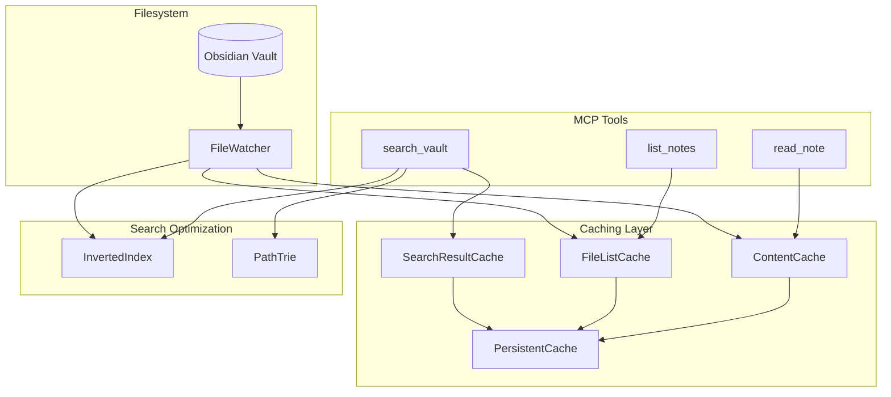

# Obsidian MCP Server

A Model Context Protocol (MCP) server that provides seamless integration with Obsidian vaults via direct filesystem access, enabling AI assistants to interact with your notes and knowledge base.

## Features

- **Note Management**: Create, read, update, and delete notes
- **Folder Operations**: Create, rename, move, and delete folders
- **Vault Search**: Search with glob patterns, regex, tags, frontmatter, and relevance scoring
- **Intelligent Caching**: Multi-layer caching with optional LMDB persistence
- **Real-Time Monitoring**: File watching for automatic cache invalidation

## Quick Start

### Installation

```bash
npm install
npm run build
```

### Configuration

Add to your MCP client configuration:

```json
{
  "mcpServers": {
    "obsidian": {
      "command": "node",
      "args": ["/path/to/obsidian-mcp/build/index.js"],
      "env": {
        "OBSIDIAN_VAULT_PATH": "/path/to/your/vault"
      }
    }
  }
}
```

See [Configuration Reference](docs/configuration.md) for all options.

## Available Tools

| Tool                                                        | Description                             |
| ----------------------------------------------------------- | --------------------------------------- |
| [`list_notes`](docs/tools/list_notes.md)                    | List all notes in the vault             |
| [`read_note`](docs/tools/read_note.md)                      | Read the content of a note              |
| [`create_note`](docs/tools/create_note.md)                  | Create a new note                       |
| [`update_note`](docs/tools/update_note.md)                  | Update an existing note                 |
| [`delete_note`](docs/tools/delete_note.md)                  | Delete a note                           |
| [`get_note_metadata`](docs/tools/get_note_metadata.md)      | Get frontmatter and tags                |
| [`search_vault`](docs/tools/search_vault.md)                | Search with required query              |
| [`advanced_search_vault`](docs/tools/advanced_search_vault.md) | Advanced search with all options     |
| [`search_vault_stream`](docs/tools/search_vault_stream.md)  | Streaming search for large vaults       |
| [`manage_folder`](docs/tools/manage_folder.md)              | Create, rename, move, or delete folders |
| [`get_cache_stats`](docs/tools/get_cache_stats.md)          | Get cache performance statistics        |

See [Tools Reference](docs/tools/README.md) for detailed documentation.

## Architecture



See [Features Reference](docs/features/README.md) for detailed architecture documentation.

## Performance Features

| Feature                                                 | Description                                | Default  |
| ------------------------------------------------------- | ------------------------------------------ | -------- |
| [File List Cache](docs/features/file-list-cache.md)     | Cache folder listings                      | 60s TTL  |
| [Content Cache](docs/features/content-cache.md)         | LRU cache for file contents                | 100 entries |
| [Search Result Cache](docs/features/search-result-cache.md) | Cache search query results             | 50 entries |
| [Persistent Cache](docs/features/persistent-cache.md)   | LMDB-backed persistence                    | Disabled |
| [Inverted Index](docs/features/inverted-index.md)       | Fast word-to-files lookup                  | Disabled |
| [Path Trie](docs/features/path-trie.md)                 | Efficient glob pattern matching            | Disabled |
| [File Watcher](docs/features/file-watcher.md)           | Real-time cache invalidation               | Enabled  |
| [Cache Warmup](docs/features/cache-warmup.md)           | Pre-load cache on startup                  | Disabled |

## Configuration Quick Reference

| Variable                           | Default             | Description                          |
| ---------------------------------- | ------------------- | ------------------------------------ |
| `OBSIDIAN_VAULT_PATH`              | Required            | Path to your Obsidian vault          |
| `OBSIDIAN_ENABLE_PERSISTENT_CACHE` | `false`             | Enable LMDB persistence              |
| `OBSIDIAN_ENABLE_INVERTED_INDEX`   | `false`             | Enable fast text search index        |
| `OBSIDIAN_ENABLE_PATH_TRIE`        | `false`             | Enable fast glob matching            |
| `OBSIDIAN_ENABLE_CACHE_WARMUP`     | `false`             | Pre-load cache on startup            |

See [Configuration Reference](docs/configuration.md) for all 19 environment variables.

## Development

```bash
# Build
npm run build

# Development mode
npm run dev

# Run tests
npm test
```

### Project Structure

```
src/
├── config/                    # Configuration management
├── handlers/                  # MCP request handlers
├── services/
│   ├── cache/                 # Caching services
│   ├── search/                # Search optimization services
│   ├── fileSystem.ts          # Core filesystem operations
│   ├── FileWatcher.ts         # File change monitoring
│   └── FrontmatterParser.ts   # YAML frontmatter parsing
├── types/                     # TypeScript type definitions
├── index.ts                   # Entry point
└── server.ts                  # Main server class
```

## Documentation

- [Tools Reference](docs/tools/README.md) - All available MCP tools
- [Features Reference](docs/features/README.md) - Internal features and architecture
- [Configuration Reference](docs/configuration.md) - All environment variables

## Security

- Operations are restricted to the configured vault path
- Path traversal protection is implemented
- Consider running in a sandboxed environment for production use

## Contributing

1. Fork the repository
2. Create a feature branch
3. Make your changes
4. Add tests if applicable
5. Submit a pull request

