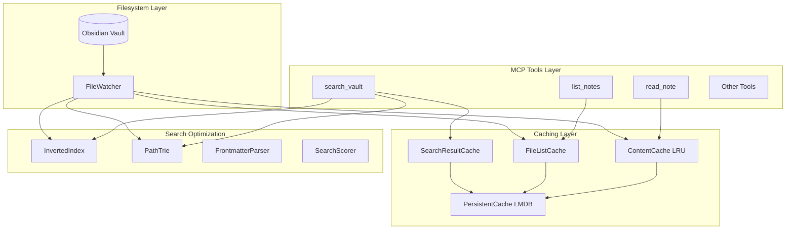
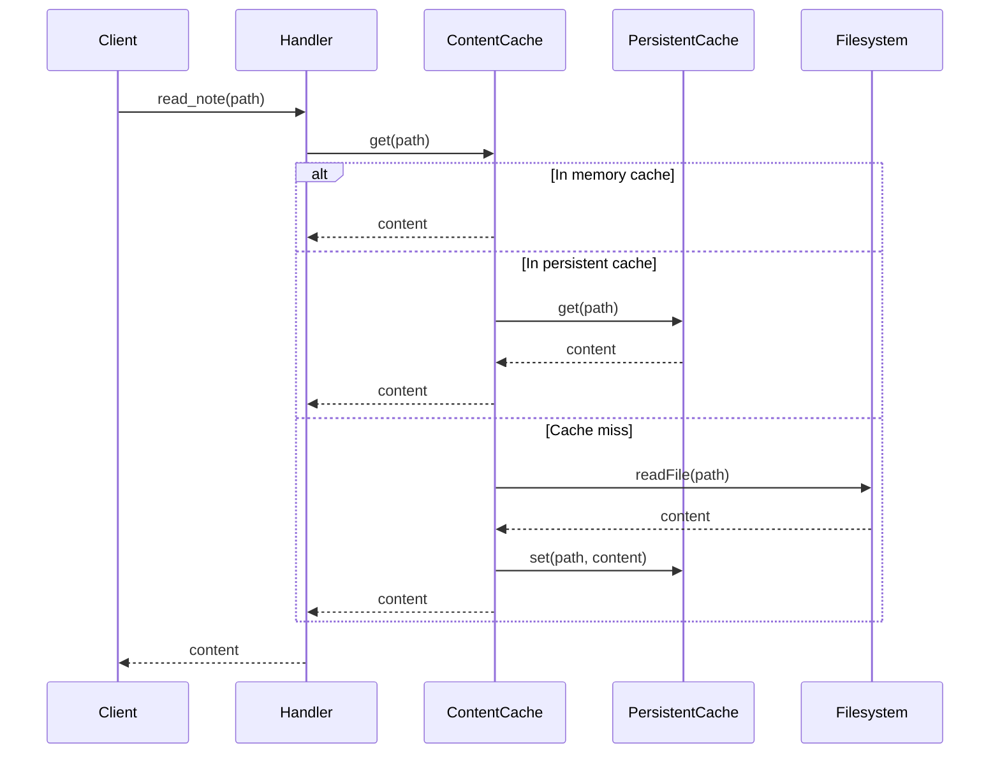
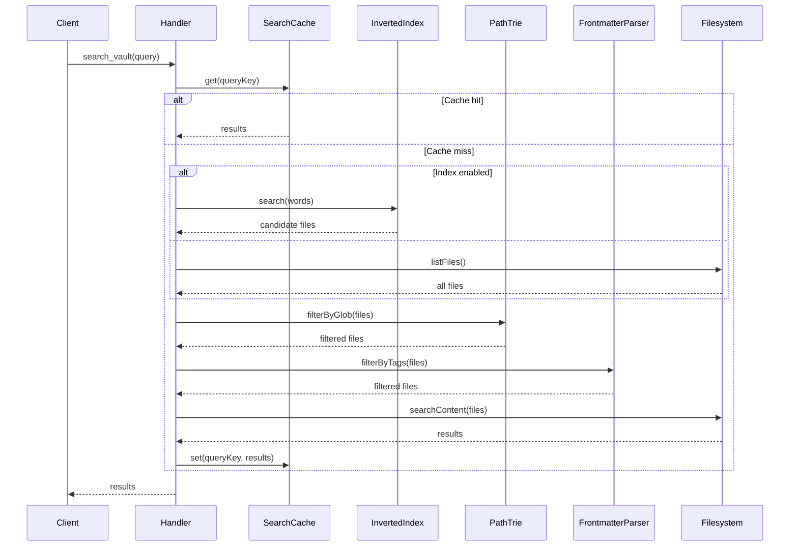

# Features Reference

This document provides an overview of all internal features and optimizations in the Obsidian MCP Server.

## Architecture Overview



## Feature Categories

### Caching Features

High-performance caching system with multiple layers.

| Feature                                       | Purpose                     | Default         |
| --------------------------------------------- | --------------------------- | --------------- |
| [File List Cache](file-list-cache.md)         | Cache folder listings       | 60s TTL         |
| [Content Cache](content-cache.md)             | LRU cache for file contents | 100 entries     |
| [Search Result Cache](search-result-cache.md) | Cache search query results  | 50 entries, 30s |
| [Persistent Cache](persistent-cache.md)       | LMDB-backed persistence     | Disabled        |
| [Cache Warmup](cache-warmup.md)               | Pre-load cache on startup   | Disabled        |

### Search Optimization Features

Advanced search capabilities with performance optimizations.

| Feature                                       | Purpose                           | Default  |
| --------------------------------------------- | --------------------------------- | -------- |
| [Inverted Index](inverted-index.md)           | Fast word-to-files lookup         | Disabled |
| [Path Trie](path-trie.md)                     | Efficient glob pattern matching   | Disabled |
| [Frontmatter Parsing](frontmatter-parsing.md) | Tag and metadata extraction       | Enabled  |
| [Scoring Algorithm](scoring-algorithm.md)     | TF-IDF-inspired relevance ranking | Enabled  |
| [Search Compression](search-compression.md)   | Compress large search results     | Disabled |

### Monitoring Features

Real-time monitoring and cache invalidation.

| Feature                         | Purpose                   | Default |
| ------------------------------- | ------------------------- | ------- |
| [File Watcher](file-watcher.md) | Monitor vault for changes | Enabled |

## Data Flow

### Read Operation



### Search Operation



## Configuration Quick Reference

All features are configurable via environment variables. See [Configuration Reference](../configuration.md) for details.

```bash
# Enable all performance features
export OBSIDIAN_ENABLE_PERSISTENT_CACHE=true
export OBSIDIAN_ENABLE_INVERTED_INDEX=true
export OBSIDIAN_ENABLE_PATH_TRIE=true
export OBSIDIAN_ENABLE_CACHE_WARMUP=true
export OBSIDIAN_COMPRESS_LARGE_RESULTS=true
```

## Memory Usage Estimates

| Feature         | Approximate Memory                 |
| --------------- | ---------------------------------- |
| Content Cache   | ~10KB per cached file              |
| File List Cache | ~100 bytes per file                |
| Search Cache    | ~1KB per cached query              |
| Inverted Index  | ~10-20 bytes per word-file mapping |
| Path Trie       | ~200-500 bytes per file path       |

## Performance Characteristics

| Scenario        | Without Optimization | With Optimization   |
| --------------- | -------------------- | ------------------- |
| First search    | O(n) files           | O(k) candidates     |
| Repeated search | O(n) files           | O(1) cache hit      |
| Glob matching   | O(n) regex tests     | O(p) trie traversal |
| File list       | O(n) filesystem      | O(1) cache hit      |
| File read       | O(1) filesystem      | O(1) memory         |

Where n = total files, k = matching candidates, p = path depth.

## See Also

- [Tools Documentation](../tools/README.md) - Available MCP tools
- [Configuration Reference](../configuration.md) - All environment variables
