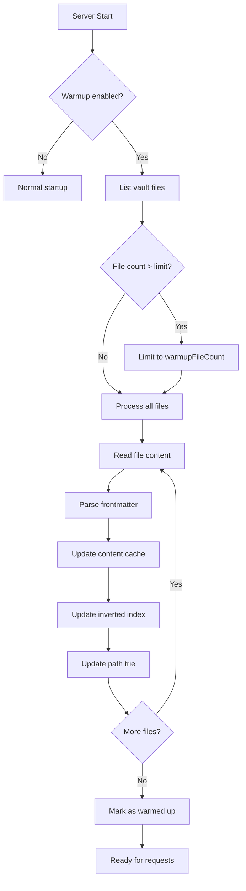
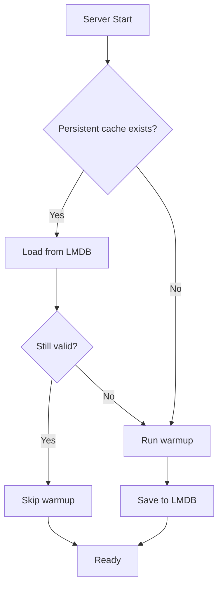

# Cache Warmup

Pre-load caches on startup for immediate performance.

## Purpose

Cache Warmup pre-populates caches and builds indexes on application startup, ensuring optimal performance from the first request rather than warming up gradually.

## How It Works



## Configuration

| Variable                       | Type      | Default | Description                     |
| ------------------------------ | --------- | ------- | ------------------------------- |
| `OBSIDIAN_ENABLE_CACHE_WARMUP` | `boolean` | `false` | Enable warmup on startup        |
| `OBSIDIAN_WARMUP_FILE_COUNT`   | `number`  | `50`    | Maximum files to pre-load       |

## Warmup Sequence

1. **List Files**: Scan vault for all markdown files
2. **Prioritize**: Sort by modification time (most recent first)
3. **Limit**: Take only `warmupFileCount` files
4. **Read**: Load file content into content cache
5. **Parse**: Extract frontmatter and inline tags
6. **Index**: Add to inverted index (if enabled)
7. **Trie**: Add to path trie (if enabled)
8. **Complete**: Set `isWarmedUp` flag

## Startup Time Impact

| Vault Size    | Without Warmup | With Warmup (default 50 files) |
| ------------- | -------------- | ------------------------------- |
| 100 files     | <100ms         | ~500ms                          |
| 1,000 files   | <100ms         | ~2-3s (limited to warmup count) |
| 10,000 files  | <100ms         | ~5-10s (limited)                |

## First Request Performance

| Scenario           | Without Warmup | With Warmup |
| ------------------ | -------------- | ----------- |
| First search       | Cold (slow)    | Warm (fast) |
| First file read    | Disk I/O       | Memory      |
| First glob match   | Trie building  | Instant     |

## When to Use

Enable warmup when:
- Server restarts are infrequent
- First-request latency is critical
- Vault size is manageable (< 5000 files)

Skip warmup when:
- Fast startup is critical
- Running in serverless environment
- Vault is very large (> 10000 files)

## Warmup Status

Check if warmup completed via [get_cache_stats](../tools/get_cache_stats.md):

```json
{
  "isWarmedUp": true
}
```

## Persistence Integration

When persistent cache is also enabled:



This provides the best of both worlds:
- Fast restarts from persistent cache
- Full warmup only on first run

## Source Files

- [`src/services/fileSystem.ts`](../../src/services/fileSystem.ts) - `warmCache()` method

## Related Features

- [Persistent Cache](persistent-cache.md) - Stores warmed data
- [Content Cache](content-cache.md) - Populated during warmup
- [Inverted Index](inverted-index.md) - Built during warmup
- [Path Trie](path-trie.md) - Built during warmup
