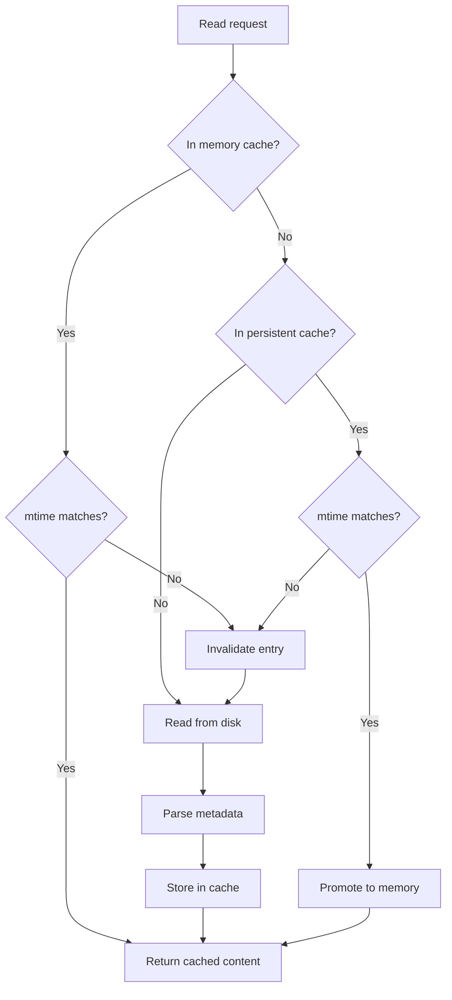
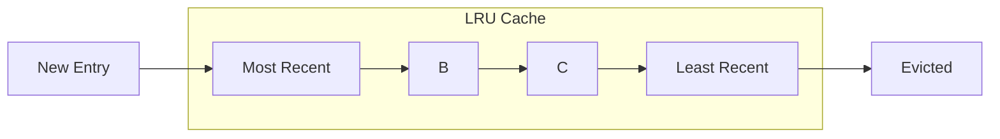

# Content Cache

LRU cache for file contents with mtime validation.

## Purpose

The Content Cache stores file contents in memory using a Least Recently Used (LRU) eviction policy. This reduces disk I/O for frequently accessed files and enables fast search operations.

## How It Works

## Configuration

| Variable                         | Type     | Default | Description                     |
| -------------------------------- | -------- | ------- | ------------------------------- |
| `OBSIDIAN_CONTENT_CACHE_MAX_SIZE`| `number` | `100`   | Maximum entries in memory cache |

## Cached Data

Each cache entry contains:

| Field               | Type       | Description                 |
| ------------------- | ---------- | --------------------------- |
| `content`           | `string`   | Raw file content            |
| `mtime`             | `number`   | File modification timestamp |
| `parsedFrontmatter` | `object`   | Parsed YAML frontmatter     |
| `wordCount`         | `number`   | Total words in file         |
| `lineCount`         | `number`   | Total lines in file         |
| `inlineTags`        | `string[]` | Extracted inline `#tags`    |

## LRU Eviction

When the cache reaches the configured max size, the least recently used entry is evicted:

## Mtime Validation

The cache validates entries against the file's modification time:

1. Get file stats from filesystem
2. Compare `mtime` with cached `mtime`
3. If different, invalidate and re-read
4. If same, return cached content

This ensures cache consistency without full file comparison.

## Persistence

When persistent caching is enabled:

- Cache entries are written to LMDB
- On startup, entries are loaded from LMDB to memory
- Memory cache acts as hot layer, LMDB as warm layer

See [Persistent Cache](persistent-cache.md) for details.

## Statistics

Available via [get_cache_stats](../tools/get_cache_stats.md):

| Stat             | Description                  |
| ---------------- | ---------------------------- |
| `size`           | Current entries in memory    |
| `maxSize`        | Maximum cache capacity       |
| `files`          | List of cached file paths    |
| `persistentSize` | Entries in LMDB (if enabled) |

## Performance Impact

| Operation        | Without Cache | With Cache |
| ---------------- | ------------- | ---------- |
| Read 10KB file   | ~5-10ms       | <0.1ms     |
| Search 100 files | ~500-1000ms   | ~10-50ms   |
| Repeated read    | ~5-10ms       | <0.1ms     |

## Source Files

- [`src/services/cache/ContentCache.ts`](../../src/services/cache/ContentCache.ts)

## Related Features

- [Persistent Cache](persistent-cache.md) - LMDB backing
- [File Watcher](file-watcher.md) - Automatic invalidation
- [Inverted Index](inverted-index.md) - Uses cached content for indexing
