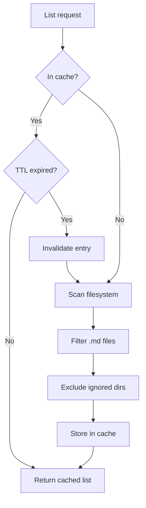

# File List Cache

Caches folder listings to avoid repeated filesystem scans.

## Purpose

The File List Cache reduces filesystem I/O by caching the results of directory listings. This is particularly beneficial for vaults with many files where listing operations can be slow.

## How It Works

## Configuration

| Variable             | Type     | Default | Description               |
| -------------------- | -------- | ------- | ------------------------- |
| `OBSIDIAN_CACHE_TTL` | `number` | `60000` | Cache TTL in milliseconds |

## Cache Key Structure

The cache uses folder paths as keys:

| Key Example     | Value                          |
| --------------- | ------------------------------ |
| `""`            | All files in vault root        |
| `"notes"`       | Files in `notes/` folder       |
| `"projects/24"` | Files in `projects/24/` folder |

## Invalidation

The cache is invalidated when:

1. **TTL expires**: Entries older than `OBSIDIAN_CACHE_TTL` are refreshed
2. **File created**: Parent folder cache invalidated
3. **File deleted**: Parent folder cache invalidated
4. **File moved**: Source and destination folder caches invalidated
5. **Folder operations**: All related folder caches invalidated

## Persistence

When persistent caching is enabled, the file list cache is backed by LMDB:

See [Persistent Cache](persistent-cache.md) for details.

## Statistics

Available via [get_cache_stats](../tools/get_cache_stats.md):

| Stat             | Description                      |
| ---------------- | -------------------------------- |
| `entryCount`     | Number of cached folder listings |
| `folders`        | List of cached folder paths      |
| `ttl`            | Configured TTL in milliseconds   |
| `persistentSize` | Entries in LMDB (if enabled)     |

## Performance Impact

| Scenario                | Without Cache | With Cache  |
| ----------------------- | ------------- | ----------- |
| First list (1000 files) | ~50-100ms     | ~50-100ms   |
| Repeated list           | ~50-100ms     | <1ms        |
| After file change       | ~50-100ms     | <1ms (rest) |

## Source Files

- [`src/services/cache/FileListCache.ts`](../../src/services/cache/FileListCache.ts)

## Related Features

- [Persistent Cache](persistent-cache.md) - LMDB backing for warm restarts
- [File Watcher](file-watcher.md) - Automatic cache invalidation
