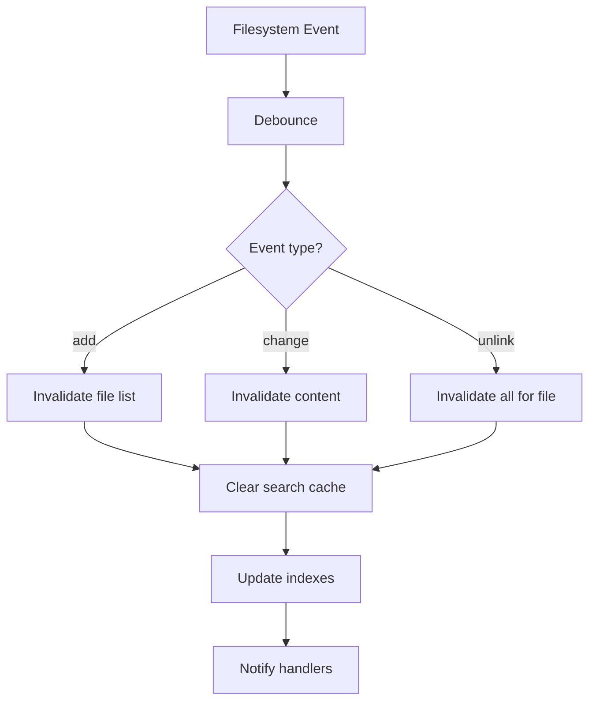
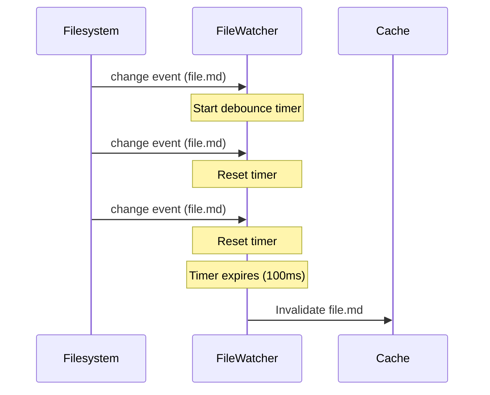
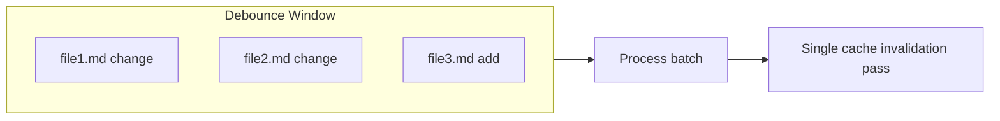

# File Watcher

Real-time filesystem monitoring with cache invalidation.

## Purpose

The File Watcher monitors the Obsidian vault for changes and automatically invalidates relevant caches, ensuring data consistency without manual cache management.

## How It Works

## Configuration

| Variable                         | Type     | Default | Description                    |
| -------------------------------- | -------- | ------- | ------------------------------ |
| `OBSIDIAN_FILE_WATCHER_DEBOUNCE` | `number` | `100`   | Debounce delay in milliseconds |

## Event Types

| Event       | Trigger               | Cache Action                        |
| ----------- | --------------------- | ----------------------------------- |
| `add`       | New file created      | Invalidate file list, indexes       |
| `change`    | File content modified | Invalidate content, search          |
| `unlink`    | File deleted          | Invalidate all related caches       |
| `addDir`    | New directory created | Invalidate file list                |
| `unlinkDir` | Directory deleted     | Invalidate file list, clear related |

## Debouncing

Rapid file changes are coalesced to prevent excessive invalidation:

## Change Coalescing

Multiple changes to different files within the debounce window are processed together:

## Ignored Paths

The watcher ignores:

- `.obsidian/` - Obsidian settings
- `.git/` - Git repository
- `node_modules/` - Node packages
- `.DS_Store` - macOS metadata

## Statistics

Available via [get_cache_stats](../tools/get_cache_stats.md):

| Stat               | Description                         |
| ------------------ | ----------------------------------- |
| `isActive`         | Whether watcher is running          |
| `vaultPath`        | Path being watched                  |
| `watchedCount`     | Number of watched directories       |
| `debounceDelay`    | Configured debounce in milliseconds |
| `pendingChanges`   | Changes waiting in debounce buffer  |
| `changesProcessed` | Total changes processed since start |

## Integration with Caches

When a file change is detected:

1. **File List Cache**: Parent folder entry invalidated
2. **Content Cache**: File entry invalidated
3. **Search Result Cache**: All entries cleared
4. **Inverted Index**: File entry invalidated
5. **Path Trie**: File entry updated

## Error Handling

| Error             | Behavior                            |
| ----------------- | ----------------------------------- |
| Permission denied | Log warning, skip file              |
| Path not found    | Ignore (file may have been deleted) |
| Watcher error     | Attempt restart, log error          |

## Source Files

- [`src/services/FileWatcher.ts`](../../src/services/FileWatcher.ts)

## Related Features

- [File List Cache](file-list-cache.md) - Invalidated on file add/delete
- [Content Cache](content-cache.md) - Invalidated on file change
- [Search Result Cache](search-result-cache.md) - Cleared on any change
