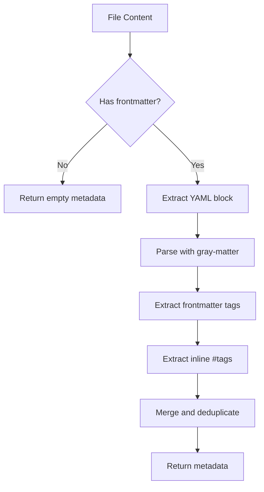

# Frontmatter Parsing

YAML frontmatter extraction and tag matching.

## Purpose

Frontmatter Parsing extracts metadata from the YAML frontmatter block at the beginning of markdown files, enabling tag-based filtering and metadata searches.

## How It Works



## Frontmatter Format

Standard YAML frontmatter block:

```markdown
---
title: My Note
author: John Doe
date: 2024-01-15
tags: [project, important]
status: draft
custom_field: value
---

# Note Content

Content with #inline-tag here.
```

## Extracted Data

| Field    | Source                         | Example                     |
| -------- | ------------------------------ | --------------------------- |
| `title`  | Frontmatter `title` field      | `"My Note"`                 |
| `author` | Frontmatter `author` field     | `"John Doe"`                |
| `tags`   | Frontmatter tags + inline tags | `["project", "inline-tag"]` |
| `*`      | Any frontmatter field          | Various                     |

## Tag Extraction

Tags are collected from two sources:

### Frontmatter Tags

```yaml
tags: [tag1, tag2, tag3]
# or
tags:
  - tag1
  - tag2
# or
tags: single-tag
```

### Inline Tags

Pattern: `#tag-name` in the content body

```markdown
This is about #project-management and #roadmap planning.

Nested tags like #work/meeting/weekly are supported.
```

## Tag Matching

When filtering by tags:

| Search Tag     | Matches                                  |
| -------------- | ---------------------------------------- |
| `project`      | `#project`, `project` in frontmatter     |
| `work/meeting` | `#work/meeting`, `#work/meeting/weekly`  |
| `Project`      | Case-insensitive: `#project`, `#PROJECT` |

## Frontmatter Matching

When filtering by frontmatter fields:

| Field Type | Matching Rule                |
| ---------- | ---------------------------- |
| String     | Case-insensitive exact match |
| Number     | Exact numeric match          |
| Boolean    | Exact boolean match          |
| Array      | Search value exists in array |

Example:

```json
{
  "frontmatter": {
    "status": "published",
    "year": 2024
  }
}
```

Matches files with:
- `status: published` or `status: Published`
- `year: 2024`

## Caching Integration

Parsed frontmatter is cached in the Content Cache:


This avoids re-parsing frontmatter on every search.

## Performance

| Operation               | Time (typical)  |
| ----------------------- | --------------- |
| Parse frontmatter       | ~1-2ms per file |
| Parse from cache        | <0.1ms          |
| Tag extraction (inline) | ~0.5ms per file |

## Dependencies

Uses the `gray-matter` library for robust YAML parsing:

- Handles complex YAML structures
- Preserves data types
- Graceful error handling

## Source Files

- [`src/services/FrontmatterParser.ts`](../../src/services/FrontmatterParser.ts)

## Related Tools

- [get_note_metadata](../tools/get_note_metadata.md) - Retrieve parsed metadata
- [search_vault](../tools/search_vault.md) - Filter by tags/frontmatter
- [advanced_search_vault](../tools/advanced_search_vault.md) - Advanced filtering

## Related Features

- [Content Cache](content-cache.md) - Stores parsed frontmatter
- [Inverted Index](inverted-index.md) - Can index frontmatter fields
