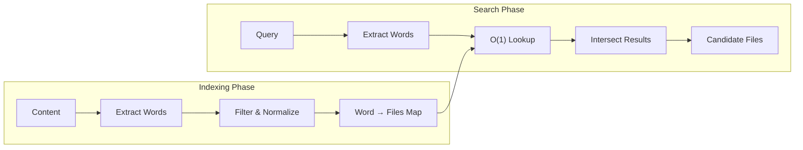
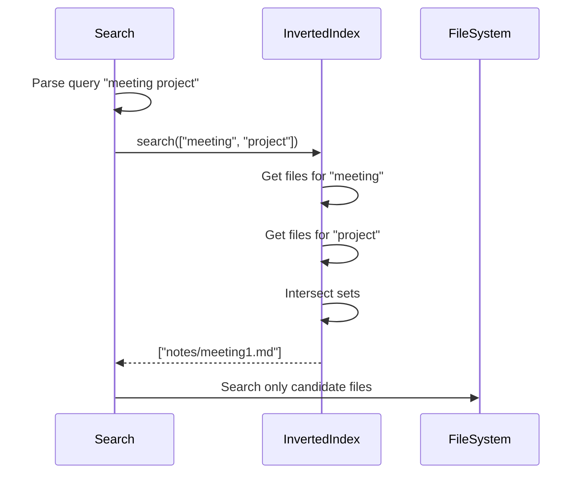

# Inverted Index

Fast word-to-files lookup for search optimization.

## Purpose

The Inverted Index provides O(1) lookup from words to the files containing them, dramatically reducing the number of files that need to be scanned during text search.

## How It Works



## Configuration

| Variable                            | Type      | Default | Description                     |
| ----------------------------------- | --------- | ------- | ------------------------------- |
| `OBSIDIAN_ENABLE_INVERTED_INDEX`    | `boolean` | `false` | Enable the inverted index       |
| `OBSIDIAN_INDEX_MIN_WORD_LENGTH`    | `number`  | `2`     | Minimum word length to index    |
| `OBSIDIAN_INDEX_MAX_WORDS_PER_FILE` | `number`  | `10000` | Maximum words to index per file |

## Index Structure

The index is a map from words to sets of file paths:

```
{
  "meeting": Set(["notes/meeting1.md", "notes/meeting2.md"]),
  "project": Set(["projects/alpha.md", "notes/meeting1.md"]),
  "deadline": Set(["projects/alpha.md"])
}
```

## Word Processing

Words are processed before indexing:

1. **Tokenization**: Split on whitespace and punctuation
2. **Normalization**: Convert to lowercase
3. **Filtering**: Remove words shorter than `minWordLength`
4. **Limiting**: Stop after `maxWordsPerFile` words

## Search Flow



## AND vs OR Logic

By default, multi-word searches use AND logic:

| Query             | Behavior                                      |
| ----------------- | --------------------------------------------- |
| `meeting project` | Files containing BOTH "meeting" AND "project" |
| Single word       | Files containing that word                    |

## Incremental Updates

The index updates incrementally:

| Event         | Index Action                         |
| ------------- | ------------------------------------ |
| File created  | Index file on first read             |
| File modified | Remove old mappings, add new on read |
| File deleted  | Remove all mappings for file         |

## Statistics

Available via [get_cache_stats](../tools/get_cache_stats.md) with `extended: true`:

| Stat                  | Description                    |
| --------------------- | ------------------------------ |
| `enabled`             | Whether index is active        |
| `uniqueWords`         | Number of unique indexed words |
| `indexedFiles`        | Number of files in the index   |
| `totalMappings`       | Total word-to-file mappings    |
| `memoryEstimateBytes` | Estimated memory usage         |

## Performance Impact

| Scenario                   | Without Index       | With Index        |
| -------------------------- | ------------------- | ----------------- |
| Search "meeting" (10 hits) | Scan all 1000 files | Scan 10 files     |
| Search "the" (900 hits)    | Scan all 1000 files | Scan 900 files    |
| Multi-word search          | Scan all files      | Scan intersection |

Best for:
- Specific, distinctive search terms
- Multi-word queries (intersection reduces candidates)

Less effective for:
- Very common words
- Single-character searches

## Memory Usage

Estimated memory per entry:
- ~50 bytes per unique word
- ~8 bytes per word-file mapping

Example: 10,000 unique words × 5 files average = ~500KB

## Source Files

- [`src/services/search/InvertedIndex.ts`](../../src/services/search/InvertedIndex.ts)

## Related Features

- [Content Cache](content-cache.md) - Source of indexed content
- [File Watcher](file-watcher.md) - Triggers index updates
- [Path Trie](path-trie.md) - Complementary path filtering
