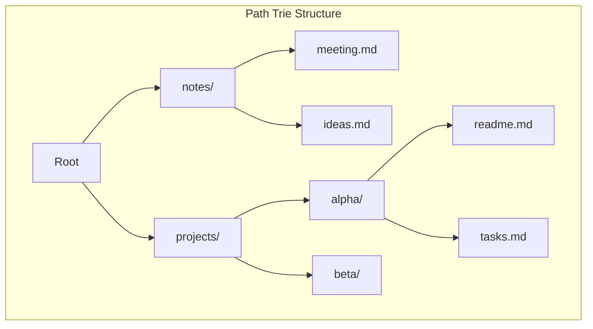
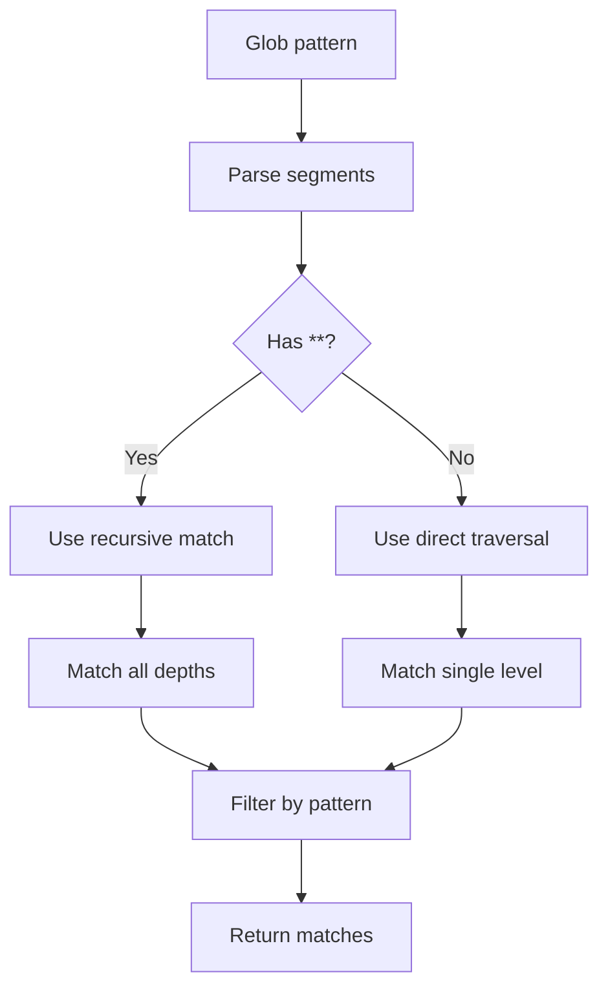

# Path Trie

Trie-based data structure for efficient glob pattern matching.

## Purpose

The Path Trie stores file paths in a trie structure, enabling fast prefix searches and glob pattern matching without scanning all files.

## How It Works



## Configuration

| Variable                    | Type      | Default | Description          |
| --------------------------- | --------- | ------- | -------------------- |
| `OBSIDIAN_ENABLE_PATH_TRIE` | `boolean` | `false` | Enable the path trie |

## Operations

### Insert

Add a file path to the trie:

```mermaid
flowchart LR
    A["notes/meeting.md"] --> B[Split by /]
    B --> C["notes", "meeting.md"]
    C --> D[Create/traverse nodes]
    D --> E[Mark leaf as file]
```

### Prefix Match

Find all files under a path prefix:


### Glob Match

Match files against glob patterns:

| Pattern               | Matches                              |
| --------------------- | ------------------------------------ |
| `notes/*.md`          | `notes/meeting.md`, `notes/ideas.md` |
| `projects/**/*.md`    | All `.md` files under `projects/`    |
| `**/readme.md`        | All `readme.md` files at any depth   |
| `projects/*/tasks.md` | `projects/alpha/tasks.md`, etc.      |

## Glob Matching Algorithm



## Performance Comparison

| Operation            | Full Scan  | Path Trie      |
| -------------------- | ---------- | -------------- |
| List `notes/*`       | O(n) files | O(k) matches   |
| List `**/readme.md`  | O(n) files | O(depth × k)   |
| Check if path exists | O(n) files | O(path length) |

Where n = total files, k = matching files.

## Statistics

Available via [get_cache_stats](../tools/get_cache_stats.md) with `extended: true`:

| Stat                  | Description                 |
| --------------------- | --------------------------- |
| `fileCount`           | Number of files in the trie |
| `nodeCount`           | Total trie nodes            |
| `maxDepth`            | Maximum path depth          |
| `memoryEstimateBytes` | Estimated memory usage      |

## Incremental Updates

| Event        | Trie Action                 |
| ------------ | --------------------------- |
| File created | Insert path                 |
| File deleted | Remove path                 |
| File renamed | Remove old, insert new      |
| Folder moved | Update all descendant paths |

## Memory Usage

Each node stores:
- Segment string (~50 bytes average)
- Children map (~100 bytes)
- File flag (~1 byte)

Example: 1,000 files with average depth 4 = ~600KB

## Source Files

- [`src/services/search/PathTrie.ts`](../../src/services/search/PathTrie.ts)

## Related Features

- [Inverted Index](inverted-index.md) - Complementary text search
- [File Watcher](file-watcher.md) - Triggers trie updates
- [File List Cache](file-list-cache.md) - Alternative for simple listings
