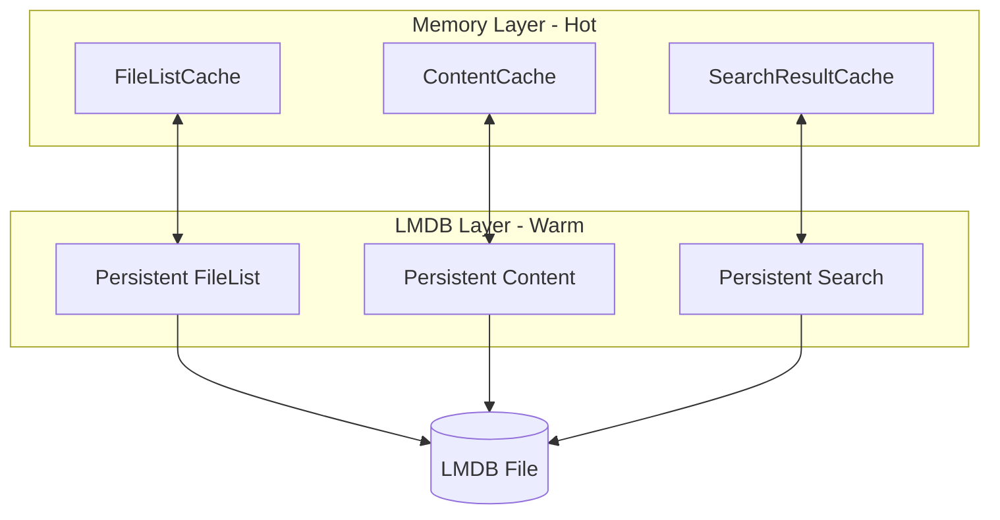
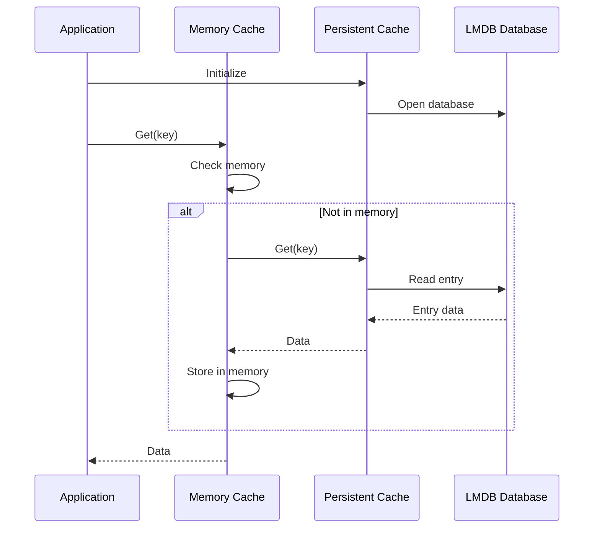
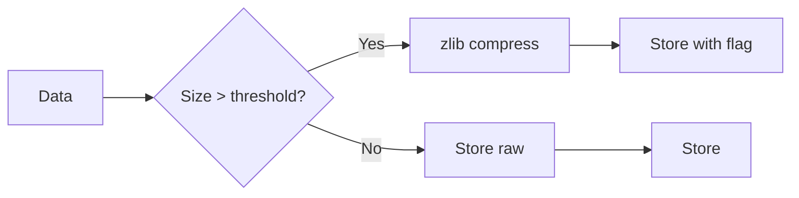

# Persistent Cache

LMDB-backed persistence for warm restarts.

## Purpose

The Persistent Cache provides disk-backed storage for all caches using LMDB (Lightning Memory-Mapped Database). This enables warm restarts where caches are pre-populated on startup.

## How It Works



## Configuration

| Variable                           | Type      | Default             | Description             |
| ---------------------------------- | --------- | ------------------- | ----------------------- |
| `OBSIDIAN_ENABLE_PERSISTENT_CACHE` | `boolean` | `true`              | Enable LMDB persistence |
| `OBSIDIAN_CACHE_PATH`              | `string`  | `./.obsidian-cache` | Path to LMDB database   |

## Why LMDB?

LMDB was chosen over LevelDB for this use case because:

| Aspect            | LMDB                      | LevelDB          |
| ----------------- | ------------------------- | ---------------- |
| Read performance  | Excellent (memory-mapped) | Good             |
| Write performance | Good                      | Excellent        |
| ACID transactions | Full support              | Limited          |
| Multi-process     | Safe concurrent access    | Single process   |
| Startup time      | Instant (mmap)            | Requires loading |
| Our workload      | Read-heavy ✓              | Write-heavy      |

## Database Structure

A single LMDB environment contains multiple named databases:

| Database   | Contents                    | Key Format  |
| ---------- | --------------------------- | ----------- |
| `fileList` | File listings by folder     | Folder path |
| `content`  | File contents with metadata | File path   |
| `search`   | Search results              | Query hash  |

## Entry Format

Each entry is stored with metadata:

```typescript
interface PersistentEntry<T> {
  data: T;           // The cached data
  mtime?: number;    // File modification time (for validation)
  timestamp: number; // When entry was stored
}
```

## Warm Restart Flow



## Mtime Validation

Persistent entries are validated against current file modification times:

1. Read entry from LMDB
2. Get current file stats
3. Compare `mtime` values
4. If different, invalidate and re-read from disk
5. If same, use cached data

## Compression

Large entries can be compressed before storage:



## Statistics

Available via [get_cache_stats](../tools/get_cache_stats.md):

| Stat        | Description                   |
| ----------- | ----------------------------- |
| `enabled`   | Whether persistence is active |
| `dbPath`    | Path to LMDB database         |
| `databases` | List of active databases      |

Per-cache stats include:
- `persistentSize` - Entries in LMDB
- `persistentEnabled` - Whether that cache uses LMDB

## Graceful Shutdown

On application shutdown:

1. Flush any pending writes
2. Close LMDB transactions
3. Close database handles
4. Release memory mappings

## Source Files

- [`src/services/cache/PersistentCache.ts`](../../src/services/cache/PersistentCache.ts)

## Related Features

- [File List Cache](file-list-cache.md) - Uses persistent backing
- [Content Cache](content-cache.md) - Uses persistent backing
- [Search Result Cache](search-result-cache.md) - Uses persistent backing
- [Cache Warmup](cache-warmup.md) - Leverages persistent data
