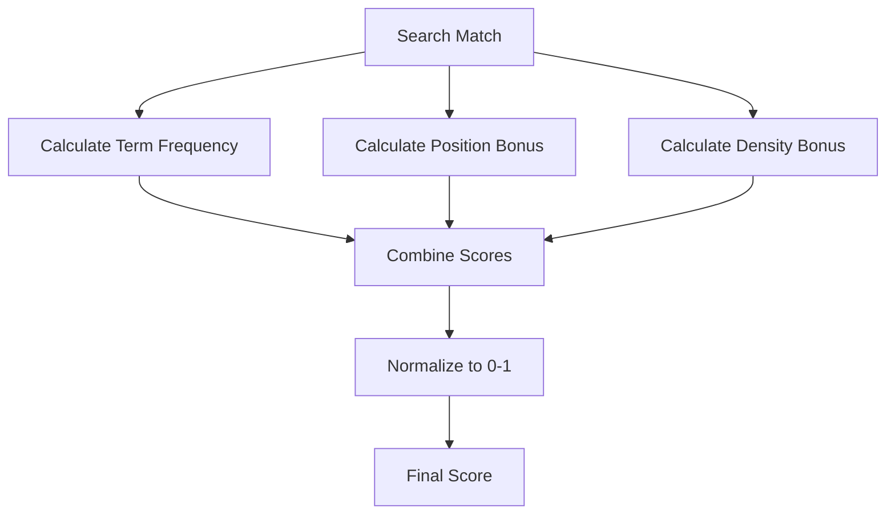

# Scoring Algorithm

TF-IDF-inspired relevance ranking for search results.

## Purpose

The Scoring Algorithm ranks search results by relevance, ensuring the most important matches appear first. It uses a TF-IDF-inspired approach adapted for markdown documents.

## How It Works



## Score Components

| Component      | Weight | Description                                   |
| -------------- | ------ | --------------------------------------------- |
| Term Frequency | 40%    | How often the search term appears in the file |
| Position Bonus | 30%    | Higher scores for matches near file beginning |
| Density Bonus  | 30%    | Higher scores for matches in shorter files    |

## Term Frequency

Measures how often the search term appears:

```
tf = matchCount / totalWords
tfScore = min(tf * 10, 1.0) * 0.4
```

- More matches = higher score
- Capped at 1.0 to prevent long documents from dominating

## Position Bonus

Rewards matches near the beginning of the file:

```
avgPosition = average(matchPositions) / totalLength
positionScore = (1 - avgPosition) * 0.3
```

- Matches at position 0 (start) = full bonus
- Matches at end = minimal bonus

Rationale: Important content often appears early in documents.

## Density Bonus

Rewards matches in shorter, focused documents:

```
density = matchCount / totalWords
densityScore = min(density * 20, 1.0) * 0.3
```

- Higher match density = higher score
- Prevents long documents from always ranking higher

## Final Score Calculation

```
score = tfScore + positionScore + densityScore
// Range: 0.0 to 1.0
```

## Example Scoring

| File      | Matches | Words | Avg Position | Score |
| --------- | ------- | ----- | ------------ | ----- |
| short.md  | 5       | 100   | 0.2          | 0.82  |
| medium.md | 5       | 500   | 0.5          | 0.54  |
| long.md   | 5       | 2000  | 0.8          | 0.31  |

## Multi-word Queries

For queries with multiple words:

1. Search for all words
2. Calculate score for each word
3. Average the scores
4. Bonus for matches near each other

## Minimum Score Filtering

Use `minScore` parameter to filter low-quality matches:

```json
{
  "query": "meeting",
  "minScore": 0.5
}
```

Recommended thresholds:

| Threshold | Use Case                  |
| --------- | ------------------------- |
| 0.0       | Include all matches       |
| 0.3       | Filter noise              |
| 0.5       | Focus on relevant results |
| 0.7       | Only high-quality matches |

## Sorting

Results are sorted by score in descending order:

```
results.sort((a, b) => b.score - a.score)
```

Then paginated with `limit` and `offset`.

## Match Context

Each match includes context for display:

| Field     | Description                           |
| --------- | ------------------------------------- |
| `line`    | Line number (1-indexed)               |
| `column`  | Column position in line               |
| `context` | Surrounding lines (1 before, 1 after) |
| `snippet` | The specific matched text             |

## Source Files

- [`src/services/search/SearchScorer.ts`](../../src/services/search/SearchScorer.ts)
- [`src/services/search/MatchExtractor.ts`](../../src/services/search/MatchExtractor.ts)

## Related Tools

- [search_vault](../tools/search_vault.md) - Uses scoring
- [advanced_search_vault](../tools/advanced_search_vault.md) - Uses scoring
- [search_vault_stream](../tools/search_vault_stream.md) - Uses scoring

## Related Features

- [Inverted Index](inverted-index.md) - Provides match candidates
- [Search Result Cache](search-result-cache.md) - Caches scored results
