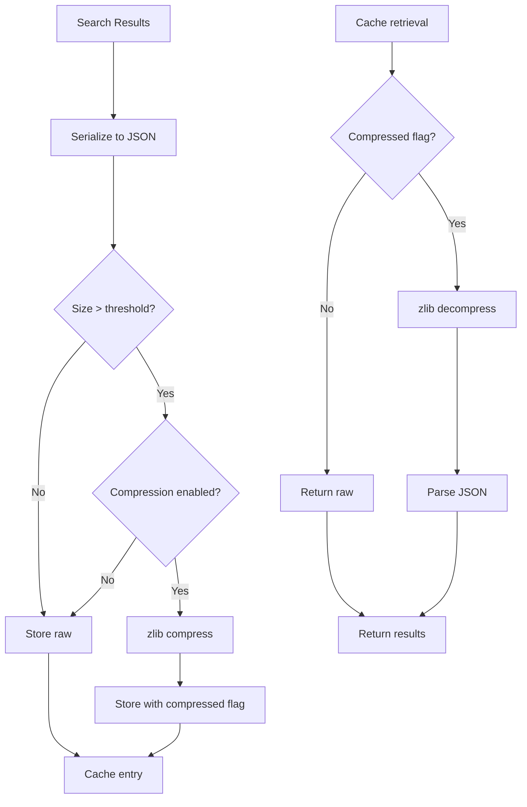
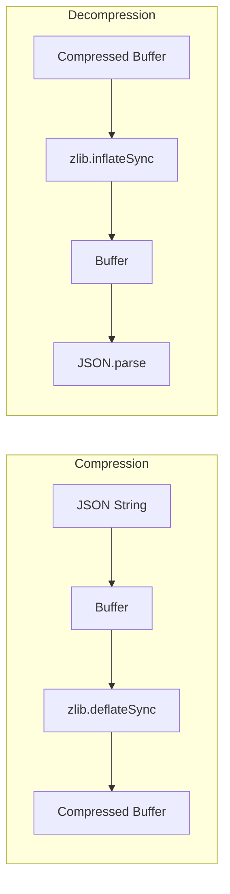

# Search Compression

Zlib compression for large search results.

## Purpose

Search Compression reduces memory usage and persistent storage size by compressing large search result sets before caching.

## How It Works



## Configuration

| Variable                          | Type      | Default | Description                    |
| --------------------------------- | --------- | ------- | ------------------------------ |
| `OBSIDIAN_COMPRESS_LARGE_RESULTS` | `boolean` | `false` | Enable compression             |
| `OBSIDIAN_COMPRESSION_THRESHOLD`  | `number`  | `10240` | Size threshold in bytes (10KB) |

## Compression Algorithm

Uses Node.js built-in zlib with default compression level:

- **Algorithm**: DEFLATE (zlib)
- **Level**: Default (balance of speed and ratio)
- **Format**: Raw deflate stream

## Size Reduction

Typical compression ratios for search results:

| Result Type              | Original Size | Compressed | Ratio |
| ------------------------ | ------------- | ---------- | ----- |
| 10 results, minimal      | ~5KB          | ~2KB       | 60%   |
| 50 results, with context | ~50KB         | ~15KB      | 70%   |
| 100 results, full        | ~150KB        | ~40KB      | 73%   |

## Performance Trade-off

| Aspect       | Without Compression | With Compression  |
| ------------ | ------------------- | ----------------- |
| Memory usage | Higher              | Lower             |
| Cache write  | Faster              | +5-10ms per entry |
| Cache read   | Faster              | +2-5ms per entry  |
| Storage size | Larger              | ~30% of original  |

## When to Enable

Enable compression when:
- Memory is constrained
- Persistent cache storage is limited
- Search results are large (many matches with context)
- Network bandwidth matters (if results transmitted)

Skip compression when:
- CPU is constrained
- Results are typically small
- Latency is critical

## Statistics

Available via [get_cache_stats](../tools/get_cache_stats.md):

```json
{
  "searchCache": {
    "compressionStats": {
      "compressedCount": 15,
      "totalOriginalSize": 1500000,
      "totalCompressedSize": 450000,
      "averageRatio": 0.70
    }
  }
}
```

| Stat                  | Description                  |
| --------------------- | ---------------------------- |
| `compressedCount`     | Number of compressed entries |
| `totalOriginalSize`   | Sum of uncompressed sizes    |
| `totalCompressedSize` | Sum of compressed sizes      |
| `averageRatio`        | Average compression ratio    |

## Implementation Details



## Error Handling

| Error               | Behavior                            |
| ------------------- | ----------------------------------- |
| Compression fails   | Store uncompressed, log warning     |
| Decompression fails | Return null, log error              |
| Corrupted data      | Invalidate entry, re-execute search |

## Source Files

- [`src/services/cache/SearchResultCache.ts`](../../src/services/cache/SearchResultCache.ts)

## Related Features

- [Search Result Cache](search-result-cache.md) - Where compression is applied
- [Persistent Cache](persistent-cache.md) - Benefits from smaller entries
