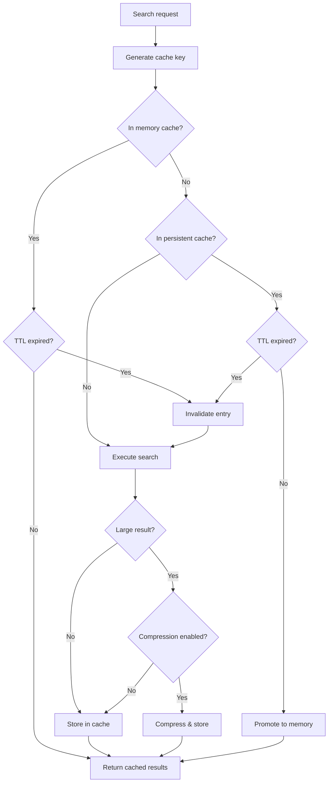
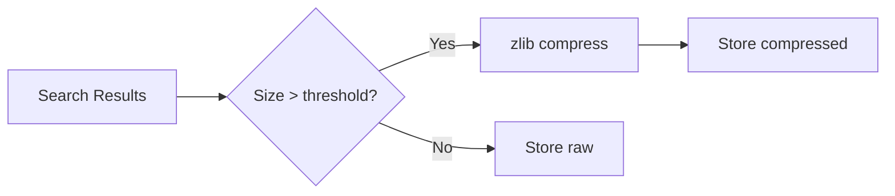

# Search Result Cache

LRU cache for search query results with TTL expiration.

## Purpose

The Search Result Cache stores the results of search queries to avoid re-executing expensive search operations for repeated queries.

## How It Works



## Configuration

| Variable                          | Type      | Default  | Description                            |
| --------------------------------- | --------- | -------- | -------------------------------------- |
| `OBSIDIAN_SEARCH_CACHE_MAX_SIZE`  | `number`  | `50`     | Maximum entries in cache               |
| `OBSIDIAN_SEARCH_CACHE_TTL`       | `number`  | `30000`  | TTL in milliseconds (30 seconds)       |
| `OBSIDIAN_COMPRESS_LARGE_RESULTS` | `boolean` | `false`  | Enable compression for large results   |
| `OBSIDIAN_COMPRESSION_THRESHOLD`  | `number`  | `100000` | Size threshold for compression (bytes) |

## Cache Key Generation

Cache keys are generated from search parameters:

```
query={query}&glob={glob}&regex={regex}&tags={tags}&frontmatter={fm}&limit={limit}&offset={offset}
```

This ensures different search configurations get separate cache entries.

## TTL Expiration

Unlike the content cache, search results have a time-to-live:

- Results expire after `OBSIDIAN_SEARCH_CACHE_TTL` milliseconds
- Expired entries are removed on next access
- Short TTL ensures results reflect recent vault changes

## Compression

When enabled, large search results are compressed:



See [Search Compression](search-compression.md) for details.

## Invalidation

The cache is invalidated when:

1. **TTL expires**: Entries older than TTL are refreshed
2. **File modified**: All search cache cleared
3. **File created**: All search cache cleared
4. **File deleted**: All search cache cleared

Note: Search cache is cleared entirely on any file change because determining which queries are affected is complex.

## Statistics

Available via [get_cache_stats](../tools/get_cache_stats.md):

| Stat               | Description                    |
| ------------------ | ------------------------------ |
| `size`             | Current entries in memory      |
| `maxSize`          | Maximum cache capacity         |
| `ttl`              | Configured TTL in milliseconds |
| `persistentSize`   | Entries in LMDB (if enabled)   |
| `compressedCount`  | Number of compressed entries   |
| `compressionRatio` | Average compression ratio      |

## Performance Impact

| Scenario                 | Without Cache | With Cache |
| ------------------------ | ------------- | ---------- |
| First search (100 files) | ~500ms        | ~500ms     |
| Repeated search          | ~500ms        | <5ms       |
| Different offset         | ~500ms        | <5ms       |

## Source Files

- [`src/services/cache/SearchResultCache.ts`](../../src/services/cache/SearchResultCache.ts)

## Related Features

- [Persistent Cache](persistent-cache.md) - LMDB backing
- [Search Compression](search-compression.md) - Result compression
- [Inverted Index](inverted-index.md) - Faster search execution
