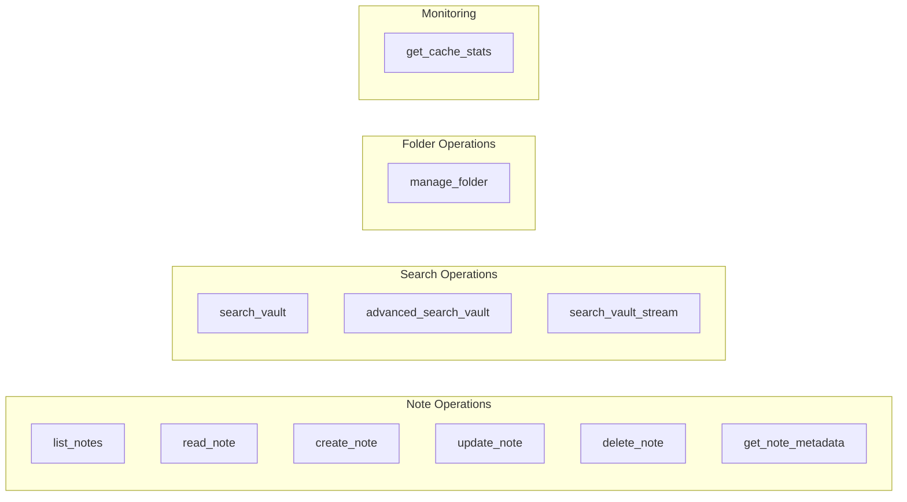

# Tools Reference

This document provides an overview of all available MCP tools in the Obsidian MCP Server.

## Tool Categories

## Quick Reference

| Tool                                                | Description                             | Required Params     |
| --------------------------------------------------- | --------------------------------------- | ------------------- |
| [`list_notes`](list_notes.md)                       | List all notes in the vault             | None                |
| [`read_note`](read_note.md)                         | Read the content of a note              | `path`              |
| [`create_note`](create_note.md)                     | Create a new note                       | `path`, `content`   |
| [`update_note`](update_note.md)                     | Update an existing note                 | `path`, `content`   |
| [`delete_note`](delete_note.md)                     | Delete a note                           | `path`              |
| [`get_note_metadata`](get_note_metadata.md)         | Get frontmatter and tags                | `path`              |
| [`search_vault`](search_vault.md)                   | Search with required query              | `query`             |
| [`advanced_search_vault`](advanced_search_vault.md) | Advanced search with all options        | At least one filter |
| [`search_vault_stream`](search_vault_stream.md)     | Streaming search for large vaults       | At least one filter |
| [`manage_folder`](manage_folder.md)                 | Create, rename, move, or delete folders | `operation`, `path` |
| [`get_cache_stats`](get_cache_stats.md)             | Get cache performance statistics        | None                |

## Note Operations

Tools for managing individual notes in your Obsidian vault.

- **[list_notes](list_notes.md)** - List all markdown files, optionally filtered by folder
- **[read_note](read_note.md)** - Read note content with automatic caching
- **[create_note](create_note.md)** - Create new notes with automatic directory creation
- **[update_note](update_note.md)** - Update existing notes or create if not exists
- **[delete_note](delete_note.md)** - Delete notes with empty directory cleanup
- **[get_note_metadata](get_note_metadata.md)** - Extract frontmatter and tags from notes

## Search Operations

Tools for searching across your vault content.

- **[search_vault](search_vault.md)** - Simple search with required query parameter
- **[advanced_search_vault](advanced_search_vault.md)** - Full-featured search with glob, regex, tags, and frontmatter filtering
- **[search_vault_stream](search_vault_stream.md)** - Streaming search that yields results incrementally

## Folder Operations

Tools for managing folder structure.

- **[manage_folder](manage_folder.md)** - Create, rename, move, or delete folders

## Monitoring

Tools for monitoring server performance.

- **[get_cache_stats](get_cache_stats.md)** - View cache statistics and performance metrics

## See Also

- [Features Documentation](../features/README.md) - How the server works internally
- [Configuration Reference](../configuration.md) - All environment variables
