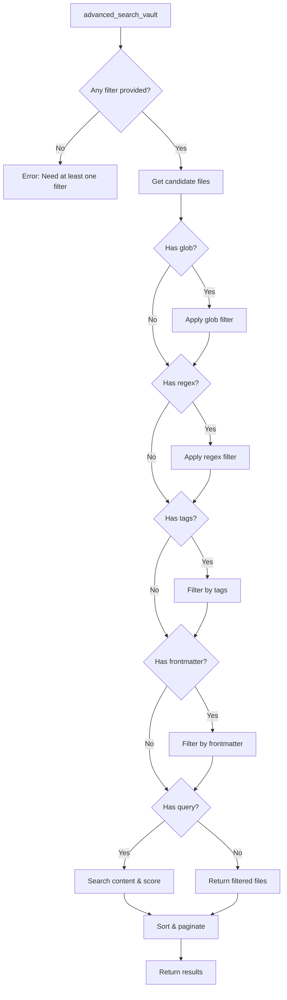

# advanced_search_vault

Advanced search with full filtering capabilities.

## Description

Performs an advanced search across the vault with support for multiple filter types. Unlike [search_vault](search_vault.md), the query parameter is optional - you can search by tags, frontmatter, glob patterns, or regex alone.

At least one of `query`, `glob`, `regex`, `tags`, or `frontmatter` must be provided.

## Parameters

| Parameter     | Type       | Required | Default | Description                            |
| ------------- | ---------- | -------- | ------- | -------------------------------------- |
| `query`       | `string`   | No       | -       | Text to search for                     |
| `glob`        | `string`   | No       | -       | Glob pattern to filter files           |
| `regex`       | `string`   | No       | -       | Regex pattern to filter files          |
| `limit`       | `number`   | No       | `100`   | Maximum results to return              |
| `offset`      | `number`   | No       | `0`     | Number of results to skip (pagination) |
| `minScore`    | `number`   | No       | -       | Minimum relevance score (0-1)          |
| `tags`        | `string[]` | No       | -       | Filter by tags (all must match)        |
| `frontmatter` | `object`   | No       | -       | Filter by frontmatter key-value pairs  |

## Returns

JSON array of search results with scores and match details.

```json
[
  {
    "path": "notes/meeting.md",
    "score": 0.85,
    "matches": [
      {
        "line": 5,
        "column": 12,
        "context": "  Line 4\n> Line 5 with **match**\n  Line 6",
        "snippet": "Line 5 with **match**"
      }
    ]
  }
]
```

## Examples

### Search by tags only

```json
{
  "name": "advanced_search_vault",
  "arguments": {
    "tags": ["project", "active"]
  }
}
```

### Search by frontmatter only

```json
{
  "name": "advanced_search_vault",
  "arguments": {
    "frontmatter": {
      "status": "published",
      "author": "John"
    }
  }
}
```

### Search by glob pattern only

```json
{
  "name": "advanced_search_vault",
  "arguments": {
    "glob": "archive/**/*.md"
  }
}
```

### Complex multi-filter search

```json
{
  "name": "advanced_search_vault",
  "arguments": {
    "query": "deployment",
    "glob": "projects/**/*.md",
    "tags": ["devops"],
    "frontmatter": { "environment": "production" },
    "minScore": 0.3,
    "limit": 50
  }
}
```

### Find all drafts

```json
{
  "name": "advanced_search_vault",
  "arguments": {
    "frontmatter": { "status": "draft" }
  }
}
```

### Find notes by author and date range (frontmatter)

```json
{
  "name": "advanced_search_vault",
  "arguments": {
    "frontmatter": {
      "author": "Jane",
      "year": 2024
    }
  }
}
```

## Behavior



### Filter Evaluation Order

Filters are applied in this order for optimal performance:

1. **Glob/Regex** - File path filtering (fastest)
2. **Tags** - Metadata filtering (uses cached frontmatter)
3. **Frontmatter** - Metadata filtering (uses cached frontmatter)
4. **Query** - Full-text search (most expensive)

### Tag Matching

Tags are matched case-insensitively and support nested tags:
- `project` matches `#project`, `#Project`, `project` in frontmatter
- `work/meeting` matches `#work/meeting` and children like `#work/meeting/weekly`

### Frontmatter Matching

Frontmatter values are matched with these rules:
- Strings: Case-insensitive exact match
- Numbers: Exact match
- Arrays: Value must be contained in the array

## Error Handling

| Error                                                 | Cause                      |
| ----------------------------------------------------- | -------------------------- |
| `"At least one of query, glob, ... must be provided"` | No filters specified       |
| `"query must be a string"`                            | Invalid query type         |
| `"tags must be an array of strings"`                  | Invalid tags format        |
| `"frontmatter must be an object"`                     | Invalid frontmatter format |

## Related Tools

- [search_vault](search_vault.md) - Simplified search with required query
- [search_vault_stream](search_vault_stream.md) - Streaming incremental results
- [get_note_metadata](get_note_metadata.md) - Inspect note metadata

## Source

- Handler: [`src/handlers/toolHandlers.ts`](../../src/handlers/toolHandlers.ts)
- Service: [`src/services/fileSystem.ts`](../../src/services/fileSystem.ts)
