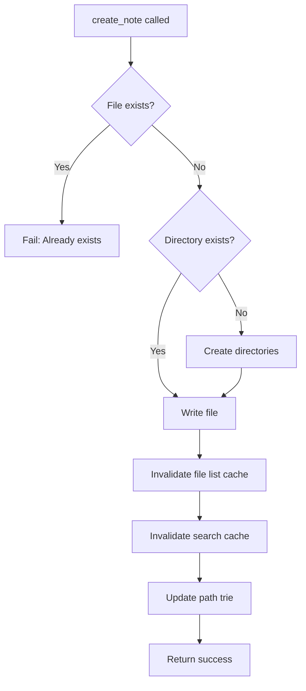

# create_note

Create a new note in the Obsidian vault.

## Description

Creates a new markdown file at the specified path. Missing directories are automatically created. The operation fails if the file already exists.

## Parameters

| Parameter | Type     | Required | Description                           |
| --------- | -------- | -------- | ------------------------------------- |
| `path`    | `string` | Yes      | Path where the note should be created |
| `content` | `string` | Yes      | Content of the note                   |

## Returns

Success message confirming creation.

```json
{
  "content": [
    {
      "type": "text",
      "text": "Note created successfully at projects/2024/meeting.md. Any missing directories were created automatically."
    }
  ]
}
```

## Examples

### Create a simple note

```json
{
  "name": "create_note",
  "arguments": {
    "path": "notes/new-idea.md",
    "content": "# New Idea\n\nThis is my new idea."
  }
}
```

### Create a note with frontmatter

```json
{
  "name": "create_note",
  "arguments": {
    "path": "blog/draft-post.md",
    "content": "---\ntitle: My Draft Post\ntags: [blog, draft]\nstatus: draft\n---\n\n# My Draft Post\n\nContent here..."
  }
}
```

### Create a note in nested directories

```json
{
  "name": "create_note",
  "arguments": {
    "path": "projects/2024/q1/january/weekly/week-01.md",
    "content": "# Week 01 Notes\n\n## Goals\n- Complete project setup"
  }
}
```

## Behavior



### Directory Creation

- Uses `fs.mkdir(dir, { recursive: true })`
- Safe operation with no risk of partial creation
- Cross-platform compatible (Windows, macOS, Linux)

### Cache Invalidation

After creating a note:
1. File list cache is invalidated
2. Search result cache is cleared
3. Path trie is updated (if enabled)

## Error Handling

| Error                             | Cause                       |
| --------------------------------- | --------------------------- |
| `"Path and content are required"` | Missing required parameters |
| `"Note already exists: {path}"`   | File already exists at path |
| `EACCES`                          | Permission denied           |

## Comparison with update_note

| Scenario            | create_note  | update_note                      |
| ------------------- | ------------ | -------------------------------- |
| File exists         | Fails        | Updates content                  |
| File doesn't exist  | Creates file | Fails (unless createIfNotExists) |
| Missing directories | Creates them | Creates them (if creating)       |

## Related Tools

- [update_note](update_note.md) - Update or create notes
- [read_note](read_note.md) - Read the created note
- [delete_note](delete_note.md) - Delete the note

## Source

- Handler: [`src/handlers/toolHandlers.ts`](../../src/handlers/toolHandlers.ts)
- Service: [`src/services/fileSystem.ts`](../../src/services/fileSystem.ts)
