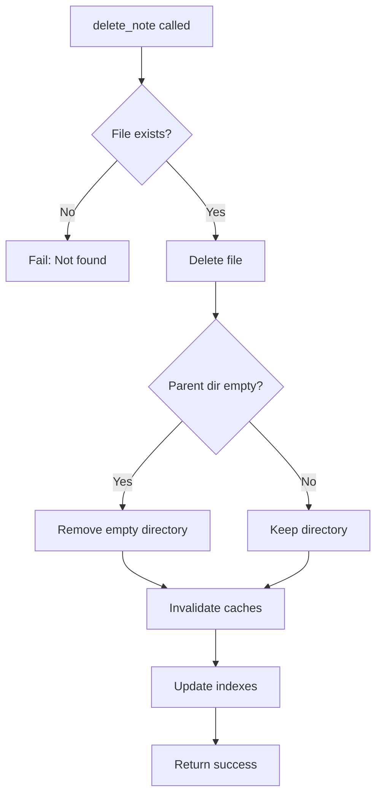

# delete_note

Delete a note from the Obsidian vault.

## Description

Removes a markdown file from the vault. Empty parent directories are automatically cleaned up after deletion.

## Parameters

| Parameter | Type     | Required | Description                       |
| --------- | -------- | -------- | --------------------------------- |
| `path`    | `string` | Yes      | Path to the note within the vault |

## Returns

Success message confirming deletion.

```json
{
  "content": [
    {
      "type": "text",
      "text": "Note deleted successfully: notes/old-meeting.md"
    }
  ]
}
```

## Examples

### Delete a note

```json
{
  "name": "delete_note",
  "arguments": {
    "path": "notes/old-meeting.md"
  }
}
```

### Delete a nested note

```json
{
  "name": "delete_note",
  "arguments": {
    "path": "archive/2023/january/report.md"
  }
}
```

## Behavior



### Empty Directory Cleanup

After deleting a note, the server checks if the parent directory is empty and removes it if so. This keeps the vault tidy without orphaned empty folders.

### Cache Invalidation

After deleting a note:
1. File list cache is invalidated
2. Content cache entry for the file is removed
3. Search result cache is cleared
4. Inverted index entry is removed
5. Path trie entry is removed

## Error Handling

| Error                      | Cause                    |
| -------------------------- | ------------------------ |
| `"Path is required"`       | Missing `path` parameter |
| `"Note not found: {path}"` | File does not exist      |
| `EACCES`                   | Permission denied        |

## Related Tools

- [create_note](create_note.md) - Create a new note
- [list_notes](list_notes.md) - List available notes
- [manage_folder](manage_folder.md) - Delete entire folders

## Source

- Handler: [`src/handlers/toolHandlers.ts`](../../src/handlers/toolHandlers.ts)
- Service: [`src/services/fileSystem.ts`](../../src/services/fileSystem.ts)
