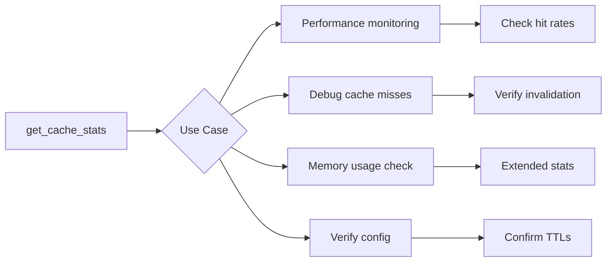

# get_cache_stats

Get cache statistics for monitoring and debugging.

## Description

Returns detailed statistics about all caching layers, the file watcher, and optionally the search optimization indexes. Useful for monitoring performance and debugging cache behavior.

## Parameters

| Parameter  | Type      | Required | Default | Description                                     |
| ---------- | --------- | -------- | ------- | ----------------------------------------------- |
| `extended` | `boolean` | No       | `false` | Include inverted index and path trie statistics |

## Returns

JSON object with cache statistics.

### Basic Response

```json
{
  "fileListCache": {
    "entryCount": 5,
    "folders": ["", "notes", "projects"],
    "ttl": 60000,
    "persistentSize": 5,
    "persistentEnabled": true
  },
  "contentCache": {
    "size": 42,
    "maxSize": 100,
    "files": ["notes/meeting.md", "projects/report.md"],
    "persistentSize": 150,
    "persistentEnabled": true
  },
  "searchCache": {
    "size": 3,
    "maxSize": 50,
    "ttl": 30000,
    "persistentSize": 10,
    "persistentEnabled": true
  },
  "fileWatcher": {
    "isActive": true,
    "vaultPath": "/path/to/vault",
    "watchedCount": 156,
    "debounceDelay": 100,
    "pendingChanges": 0,
    "changesProcessed": 24
  },
  "persistentCache": {
    "enabled": true,
    "dbPath": "./.obsidian-cache",
    "databases": ["fileList", "content", "search"]
  }
}
```

### Extended Response (with extended: true)

```json
{
  "cache": { /* same as basic response */ },
  "invertedIndex": {
    "enabled": true,
    "uniqueWords": 15420,
    "indexedFiles": 523,
    "totalMappings": 89234,
    "memoryEstimateBytes": 6012700
  },
  "pathTrie": {
    "fileCount": 523,
    "nodeCount": 1247,
    "maxDepth": 8,
    "memoryEstimateBytes": 301900
  },
  "isWarmedUp": true
}
```

## Examples

### Get basic cache stats

```json
{
  "name": "get_cache_stats",
  "arguments": {}
}
```

### Get extended stats with indexes

```json
{
  "name": "get_cache_stats",
  "arguments": {
    "extended": true
  }
}
```

## Statistics Explained

### File List Cache

| Field               | Description                        |
| ------------------- | ---------------------------------- |
| `entryCount`        | Number of cached folder listings   |
| `folders`           | List of cached folder paths        |
| `ttl`               | Time-to-live in milliseconds       |
| `persistentSize`    | Entries in persistent (LMDB) cache |
| `persistentEnabled` | Whether LMDB backing is active     |

### Content Cache

| Field               | Description                        |
| ------------------- | ---------------------------------- |
| `size`              | Current number of cached files     |
| `maxSize`           | Maximum cache capacity             |
| `files`             | List of cached file paths          |
| `persistentSize`    | Entries in persistent (LMDB) cache |
| `persistentEnabled` | Whether LMDB backing is active     |

### Search Cache

| Field               | Description                        |
| ------------------- | ---------------------------------- |
| `size`              | Current number of cached queries   |
| `maxSize`           | Maximum cache capacity             |
| `ttl`               | Time-to-live in milliseconds       |
| `persistentSize`    | Entries in persistent (LMDB) cache |
| `persistentEnabled` | Whether LMDB backing is active     |

### File Watcher

| Field              | Description                         |
| ------------------ | ----------------------------------- |
| `isActive`         | Whether file watching is running    |
| `vaultPath`        | Path being watched                  |
| `watchedCount`     | Number of watched directories       |
| `debounceDelay`    | Debounce delay in milliseconds      |
| `pendingChanges`   | Changes waiting in debounce buffer  |
| `changesProcessed` | Total changes processed since start |

### Inverted Index (extended only)

| Field                 | Description                      |
| --------------------- | -------------------------------- |
| `enabled`             | Whether inverted index is active |
| `uniqueWords`         | Number of unique indexed words   |
| `indexedFiles`        | Number of files in the index     |
| `totalMappings`       | Total word-to-file mappings      |
| `memoryEstimateBytes` | Estimated memory usage           |

### Path Trie (extended only)

| Field                 | Description                 |
| --------------------- | --------------------------- |
| `fileCount`           | Number of files in the trie |
| `nodeCount`           | Total trie nodes            |
| `maxDepth`            | Maximum path depth          |
| `memoryEstimateBytes` | Estimated memory usage      |

## Use Cases



### Performance Monitoring

Check if caches are being utilized effectively:
- High `size` relative to `maxSize` indicates active caching
- `changesProcessed` shows file watcher activity

### Debugging

- Check `persistentEnabled` to verify LMDB is working
- Check `isActive` to verify file watcher is running
- Check `pendingChanges` to see if debouncing is working

### Memory Optimization

Use extended stats to see memory usage:
- `memoryEstimateBytes` shows approximate RAM usage
- Disable indexes if memory is constrained

## Related Features

- [File List Cache](../features/file-list-cache.md)
- [Content Cache](../features/content-cache.md)
- [Search Result Cache](../features/search-result-cache.md)
- [File Watcher](../features/file-watcher.md)
- [Persistent Cache](../features/persistent-cache.md)
- [Inverted Index](../features/inverted-index.md)
- [Path Trie](../features/path-trie.md)

## Source

- Handler: [`src/handlers/toolHandlers.ts`](../../src/handlers/toolHandlers.ts)
- Service: [`src/services/fileSystem.ts`](../../src/services/fileSystem.ts)
