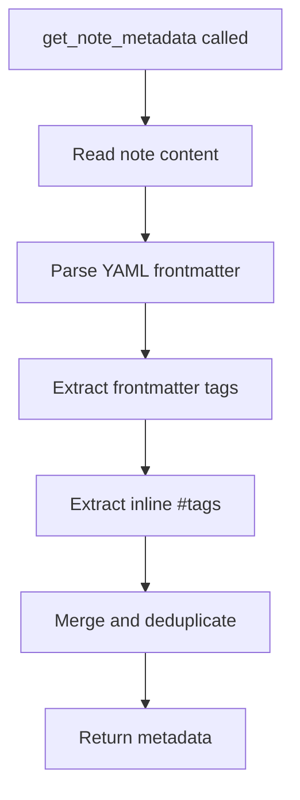

# get_note_metadata

Get the frontmatter metadata and tags from a note.

## Description

Extracts and returns the YAML frontmatter data and all tags (both from frontmatter and inline `#tags`) from a note without returning the full content.

## Parameters

| Parameter | Type     | Required | Description                       |
| --------- | -------- | -------- | --------------------------------- |
| `path`    | `string` | Yes      | Path to the note within the vault |

## Returns

JSON object containing frontmatter data and tags array.

```json
{
  "frontmatter": {
    "title": "Meeting Notes",
    "date": "2024-01-15",
    "status": "published",
    "tags": ["work", "meeting"]
  },
  "tags": ["work", "meeting", "action-items", "follow-up"]
}
```

## Examples

### Get metadata from a note

```json
{
  "name": "get_note_metadata",
  "arguments": {
    "path": "notes/meeting.md"
  }
}
```

### Example note content

```markdown
---
title: Project Planning
author: John Doe
tags: [project, planning]
status: draft
---

# Project Planning

This note is about #project-management and #roadmap planning.

## Tasks
- Review #requirements
- Create timeline
```

### Corresponding metadata response

```json
{
  "frontmatter": {
    "title": "Project Planning",
    "author": "John Doe",
    "tags": ["project", "planning"],
    "status": "draft"
  },
  "tags": ["project", "planning", "project-management", "roadmap", "requirements"]
}
```

## Behavior



### Tag Extraction

Tags are collected from two sources:

1. **Frontmatter tags**: From the `tags` field in YAML frontmatter
   - Can be an array: `tags: [tag1, tag2]`
   - Can be a single value: `tags: single-tag`

2. **Inline tags**: Hashtags in the note body
   - Pattern: `#tag-name`
   - Supports nested tags: `#parent/child`
   - Case-insensitive matching

### Frontmatter Parsing

Uses the `gray-matter` library for robust YAML parsing:
- Supports standard YAML syntax
- Handles nested objects
- Preserves data types (strings, numbers, booleans, arrays)

See [Frontmatter Parsing](../features/frontmatter-parsing.md) for details.

## Error Handling

| Error                | Cause                    |
| -------------------- | ------------------------ |
| `"Path is required"` | Missing `path` parameter |
| `ENOENT`             | File does not exist      |

## Use Cases

- **Tag-based organization**: Get all tags to build tag clouds or navigation
- **Metadata inspection**: Check frontmatter fields before processing
- **Filtering preparation**: Gather metadata for search filtering

## Related Tools

- [read_note](read_note.md) - Get full note content
- [search_vault](search_vault.md) - Search by tags
- [advanced_search_vault](advanced_search_vault.md) - Filter by frontmatter

## Source

- Handler: [`src/handlers/toolHandlers.ts`](../../src/handlers/toolHandlers.ts)
- Service: [`src/services/FrontmatterParser.ts`](../../src/services/FrontmatterParser.ts)
