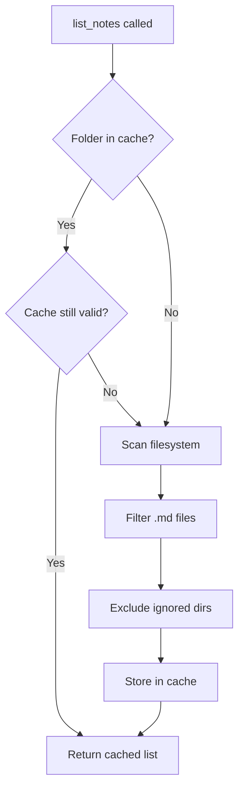

# list_notes

List all markdown notes in the Obsidian vault.

## Description

Returns a list of all `.md` files in the vault, optionally filtered to a specific folder. Results are cached for performance with automatic invalidation when files change.

## Parameters

| Parameter  | Type     | Required | Default | Description                              |
|------------|----------|----------|---------|------------------------------------------|
| `folder`   | `string` | No       | `""`    | Folder path within the vault to list     |

## Returns

JSON array of file paths relative to the vault root.

```json
[
  "notes/meeting.md",
  "notes/ideas.md",
  "projects/2024/report.md"
]
```

## Examples

### List all notes

```json
{
  "name": "list_notes",
  "arguments": {}
}
```

### List notes in a specific folder

```json
{
  "name": "list_notes",
  "arguments": {
    "folder": "projects/2024"
  }
}
```

## Behavior



### Ignored Directories

The following directories are automatically excluded:
- `.obsidian`
- `.git`
- `.DS_Store`
- `node_modules`

### Caching

- Results are cached with a configurable TTL (default: 60 seconds)
- Cache is automatically invalidated when files are created, deleted, or moved
- See [File List Cache](../features/file-list-cache.md) for details

## Related Tools

- [read_note](read_note.md) - Read the content of a listed note
- [create_note](create_note.md) - Create a new note
- [manage_folder](manage_folder.md) - Manage folder structure

## Source

- Handler: [`src/handlers/toolHandlers.ts`](../../src/handlers/toolHandlers.ts)
- Service: [`src/services/fileSystem.ts`](../../src/services/fileSystem.ts)
