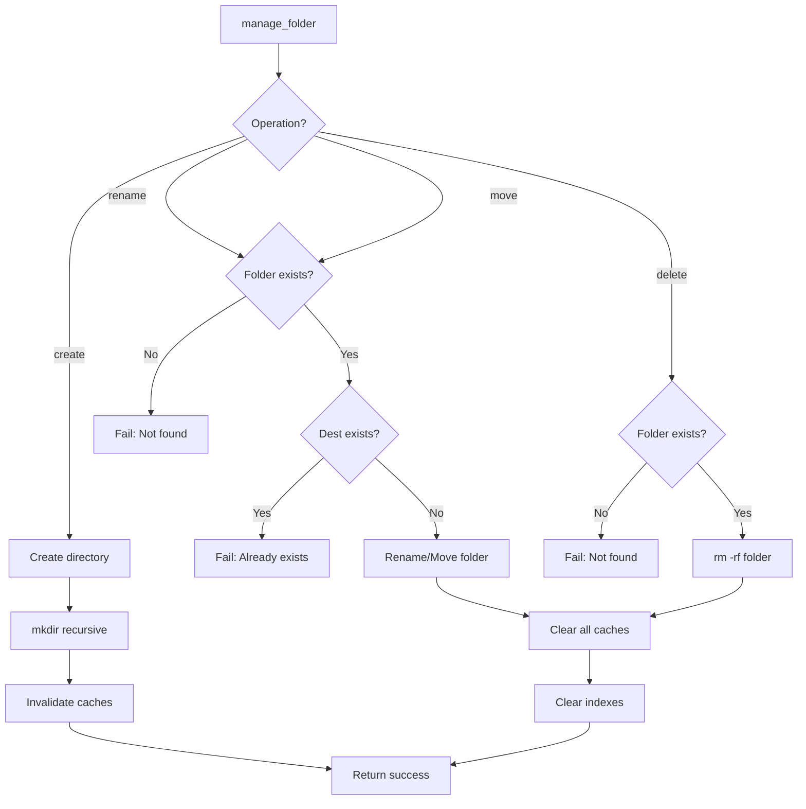

# manage_folder

Create, rename, move, or delete folders in the Obsidian vault.

## Description

Performs folder management operations. Supports creating new folders, renaming existing ones, moving folders to new locations, and deleting folders (including all contents).

## Parameters

| Parameter   | Type     | Required    | Description                                                |
| ----------- | -------- | ----------- | ---------------------------------------------------------- |
| `operation` | `string` | Yes         | Operation to perform: `create`, `rename`, `move`, `delete` |
| `path`      | `string` | Yes         | Path to the folder within the vault                        |
| `newPath`   | `string` | Conditional | New path (required for `rename` and `move`)                |

## Operations

### create

Creates a new folder at the specified path. Parent directories are created automatically.

### rename

Renames a folder (changes the folder name while keeping it in the same location).

### move

Moves a folder to a new location (can also rename during move).

### delete

Deletes a folder and all its contents recursively.

## Returns

Success message confirming the operation.

```json
{
  "content": [
    {
      "type": "text",
      "text": "Folder created successfully at projects/2024"
    }
  ]
}
```

## Examples

### Create a folder

```json
{
  "name": "manage_folder",
  "arguments": {
    "operation": "create",
    "path": "projects/2024/q1"
  }
}
```

### Rename a folder

```json
{
  "name": "manage_folder",
  "arguments": {
    "operation": "rename",
    "path": "projects/old-name",
    "newPath": "projects/new-name"
  }
}
```

### Move a folder

```json
{
  "name": "manage_folder",
  "arguments": {
    "operation": "move",
    "path": "inbox/project-notes",
    "newPath": "projects/2024/project-notes"
  }
}
```

### Delete a folder

```json
{
  "name": "manage_folder",
  "arguments": {
    "operation": "delete",
    "path": "archive/old-projects"
  }
}
```

## Behavior



### Cache Invalidation by Operation

| Operation | File List  | Content Cache | Search Cache | Indexes   |
| --------- | ---------- | ------------- | ------------ | --------- |
| create    | Invalidate | -             | Invalidate   | -         |
| rename    | Invalidate | Clear all     | Invalidate   | Clear all |
| move      | Invalidate | Clear all     | Invalidate   | Clear all |
| delete    | Invalidate | Clear all     | Invalidate   | Clear all |

### Safety Notes

- **delete** is recursive and permanent - use with caution
- **rename/move** will fail if the destination already exists
- All operations are atomic at the filesystem level

## Error Handling

| Error                                         | Cause                              |
| --------------------------------------------- | ---------------------------------- |
| `"Operation and path are required"`           | Missing required parameters        |
| `"Path and new path are required"`            | Missing newPath for rename/move    |
| `"Folder not found: {path}"`                  | Folder doesn't exist               |
| `"Destination folder already exists: {path}"` | Target path exists for rename/move |
| `"Unknown folder operation: {op}"`            | Invalid operation value            |

## Related Tools

- [list_notes](list_notes.md) - List notes (can see folder structure)
- [create_note](create_note.md) - Create notes (creates folders automatically)
- [delete_note](delete_note.md) - Delete individual notes

## Source

- Handler: [`src/handlers/toolHandlers.ts`](../../src/handlers/toolHandlers.ts)
- Service: [`src/services/fileSystem.ts`](../../src/services/fileSystem.ts)
