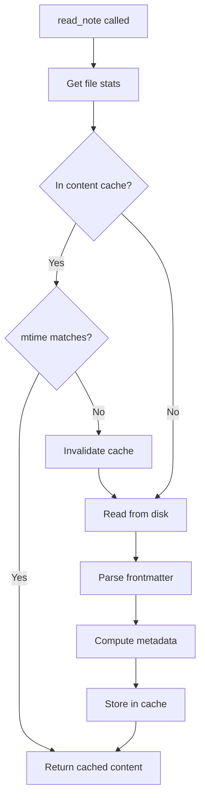

# read_note

Read the content of a note from the Obsidian vault.

## Description

Retrieves the full content of a markdown note. Content is cached with modification-time validation for optimal performance on repeated reads.

## Parameters

| Parameter | Type     | Required | Description                       |
| --------- | -------- | -------- | --------------------------------- |
| `path`    | `string` | Yes      | Path to the note within the vault |

## Returns

The raw content of the note as a string.

```
# Meeting Notes
s
## Attendees
- John
- Jane

## Action Items
- Review proposal
- Schedule follow-up
```

## Examples

### Read a note

```json
{
  "name": "read_note",
  "arguments": {
    "path": "notes/meeting.md"
  }
}
```

### Read a nested note

```json
{
  "name": "read_note",
  "arguments": {
    "path": "projects/2024/january/report.md"
  }
}
```

## Behavior



### Caching

When a note is read, the following metadata is computed and cached:
- Parsed frontmatter (tags, custom fields)
- Word count
- Line count
- Inline tags

This metadata is used to optimize subsequent search operations.

See [Content Cache](../features/content-cache.md) for details.

### Indexing

If the inverted index is enabled, the note content is automatically indexed for fast text search. See [Inverted Index](../features/inverted-index.md).

## Error Handling

| Error                | Cause                    |
| -------------------- | ------------------------ |
| `"Path is required"` | Missing `path` parameter |
| `ENOENT`             | File does not exist      |
| `EACCES`             | Permission denied        |

## Related Tools

- [list_notes](list_notes.md) - List available notes
- [get_note_metadata](get_note_metadata.md) - Get just the metadata without full content
- [update_note](update_note.md) - Modify the note content

## Source

- Handler: [`src/handlers/toolHandlers.ts`](../../src/handlers/toolHandlers.ts)
- Service: [`src/services/fileSystem.ts`](../../src/services/fileSystem.ts)
