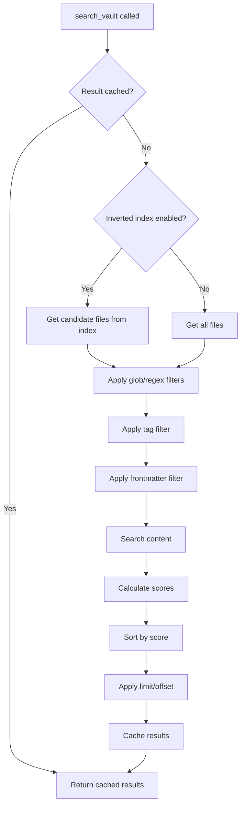

# search_vault

Search for content across the Obsidian vault.

## Description

Performs a text search across all notes in the vault with support for glob patterns, regex filtering, pagination, and tag/frontmatter filtering. This is a simplified interface that requires a query parameter. For searches without a required query, use [advanced_search_vault](advanced_search_vault.md).

## Parameters

| Parameter     | Type       | Required | Default | Description                            |
| ------------- | ---------- | -------- | ------- | -------------------------------------- |
| `query`       | `string`   | Yes      | -       | Text to search for                     |
| `glob`        | `string`   | No       | -       | Glob pattern to filter files           |
| `regex`       | `string`   | No       | -       | Regex pattern to filter files          |
| `limit`       | `number`   | No       | `100`   | Maximum results to return              |
| `offset`      | `number`   | No       | `0`     | Number of results to skip (pagination) |
| `minScore`    | `number`   | No       | -       | Minimum relevance score (0-1)          |
| `tags`        | `string[]` | No       | -       | Filter by tags (all must match)        |
| `frontmatter` | `object`   | No       | -       | Filter by frontmatter key-value pairs  |

## Returns

JSON array of search results with scores and match details.

```json
[
  {
    "path": "notes/meeting.md",
    "score": 0.85,
    "matches": [
      {
        "line": 5,
        "column": 12,
        "context": "  Line 4 content\n> Line 5 with **match**\n  Line 6 content",
        "snippet": "This is the **match** in context"
      }
    ]
  }
]
```

## Examples

### Basic text search

```json
{
  "name": "search_vault",
  "arguments": {
    "query": "meeting notes"
  }
}
```

### Search with pagination

```json
{
  "name": "search_vault",
  "arguments": {
    "query": "project",
    "limit": 10,
    "offset": 0
  }
}
```

### Search with minimum score

```json
{
  "name": "search_vault",
  "arguments": {
    "query": "important",
    "minScore": 0.5
  }
}
```

### Search within specific folder

```json
{
  "name": "search_vault",
  "arguments": {
    "query": "budget",
    "glob": "projects/2024/**/*.md"
  }
}
```

### Search with tag filter

```json
{
  "name": "search_vault",
  "arguments": {
    "query": "deadline",
    "tags": ["work", "urgent"]
  }
}
```

### Combined filters

```json
{
  "name": "search_vault",
  "arguments": {
    "query": "review",
    "tags": ["project"],
    "frontmatter": { "status": "active" },
    "limit": 20
  }
}
```

## Behavior



### Search Optimization

The search uses multiple optimization strategies:

1. **Inverted Index**: Narrows candidates using word-to-files mapping
2. **Path Trie**: Fast glob pattern matching
3. **Batch Processing**: Processes files in parallel batches
4. **Early Termination**: Stops when enough high-quality results found
5. **Result Caching**: Caches results for repeated queries

See [Inverted Index](../features/inverted-index.md) and [Path Trie](../features/path-trie.md).

### Scoring Algorithm

Results are scored using a TF-IDF-inspired algorithm:

| Component      | Weight | Description                                   |
| -------------- | ------ | --------------------------------------------- |
| Term Frequency | 40%    | How often the search term appears             |
| Position Bonus | 30%    | Higher scores for matches near file beginning |
| Density Bonus  | 30%    | Higher scores for matches in shorter files    |

See [Scoring Algorithm](../features/scoring-algorithm.md) for details.

## Error Handling

| Error                          | Cause                     |
| ------------------------------ | ------------------------- |
| `"Search query is required"`   | Missing `query` parameter |
| `"query must be a string"`     | Invalid query type        |
| `"Invalid glob pattern: ..."`  | Malformed glob pattern    |
| `"Invalid regex pattern: ..."` | Malformed regex pattern   |

## Related Tools

- [advanced_search_vault](advanced_search_vault.md) - Search without required query
- [search_vault_stream](search_vault_stream.md) - Streaming search for large vaults
- [get_note_metadata](get_note_metadata.md) - Get tags for filtering

## Source

- Handler: [`src/handlers/toolHandlers.ts`](../../src/handlers/toolHandlers.ts)
- Service: [`src/services/fileSystem.ts`](../../src/services/fileSystem.ts)
