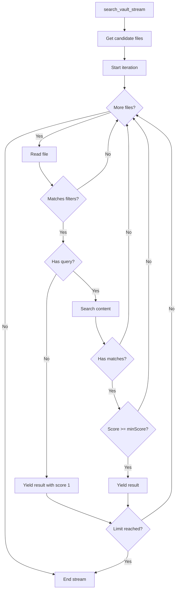

# search_vault_stream

Streaming search that yields results incrementally.

## Description

Performs a search that returns results as they are found, rather than waiting for all results to be collected. This is particularly useful for large vaults where you want to see results immediately.

At least one of `query`, `glob`, `regex`, `tags`, or `frontmatter` must be provided.

## Parameters

| Parameter     | Type       | Required | Default | Description                           |
| ------------- | ---------- | -------- | ------- | ------------------------------------- |
| `query`       | `string`   | No       | -       | Text to search for                    |
| `glob`        | `string`   | No       | -       | Glob pattern to filter files          |
| `regex`       | `string`   | No       | -       | Regex pattern to filter files         |
| `limit`       | `number`   | No       | -       | Maximum results to return             |
| `minScore`    | `number`   | No       | -       | Minimum relevance score (0-1)         |
| `tags`        | `string[]` | No       | -       | Filter by tags (all must match)       |
| `frontmatter` | `object`   | No       | -       | Filter by frontmatter key-value pairs |

**Note**: Unlike `search_vault`, there is no `offset` parameter since streaming naturally handles pagination through the limit.

## Returns

JSON array of search results (collected from the stream).

```json
[
  {
    "path": "notes/first-match.md",
    "score": 0.9,
    "matches": [...]
  },
  {
    "path": "notes/second-match.md",
    "score": 0.8,
    "matches": [...]
  }
]
```

## Examples

### Stream search for a query

```json
{
  "name": "search_vault_stream",
  "arguments": {
    "query": "important project"
  }
}
```

### Stream with limit

```json
{
  "name": "search_vault_stream",
  "arguments": {
    "query": "meeting",
    "limit": 10
  }
}
```

### Stream search by tags

```json
{
  "name": "search_vault_stream",
  "arguments": {
    "tags": ["work", "urgent"]
  }
}
```

### Stream with multiple filters

```json
{
  "name": "search_vault_stream",
  "arguments": {
    "query": "deployment",
    "glob": "projects/**/*.md",
    "minScore": 0.5,
    "limit": 20
  }
}
```

## Behavior



### Streaming vs Batch Search

| Aspect            | search_vault      | search_vault_stream      |
| ----------------- | ----------------- | ------------------------ |
| Result delivery   | All at once       | As found                 |
| Sorting           | Sorted by score   | Order of discovery       |
| Caching           | Results cached    | Not cached               |
| Early termination | Smart termination | Simple limit check       |
| Use case          | Most searches     | Large vaults, quick peek |

### When to Use Streaming

- **Large vaults**: When you have thousands of notes
- **Quick preview**: When you want to see some results immediately
- **Memory constraints**: When full result sets might be too large
- **Interactive exploration**: When browsing search results progressively

### Implementation Details

The streaming search:
1. Uses an async generator internally
2. Processes files one at a time
3. Yields results immediately when found
4. Respects the limit parameter for early stopping
5. Does NOT use the search result cache (results are not stored)

## Differences from Regular Search

1. **No offset**: Pagination is handled through limit only
2. **No result caching**: Each search is fresh
3. **Order not guaranteed**: Results come in discovery order, not score order
4. **No early termination optimization**: Doesn't use the "2x buffer" strategy

## Error Handling

| Error                                                 | Cause                |
| ----------------------------------------------------- | -------------------- |
| `"At least one of query, glob, ... must be provided"` | No filters specified |

## Related Tools

- [search_vault](search_vault.md) - Standard search with caching
- [advanced_search_vault](advanced_search_vault.md) - Full filtering without required query

## Source

- Handler: [`src/handlers/toolHandlers.ts`](../../src/handlers/toolHandlers.ts)
- Service: [`src/services/fileSystem.ts`](../../src/services/fileSystem.ts)
