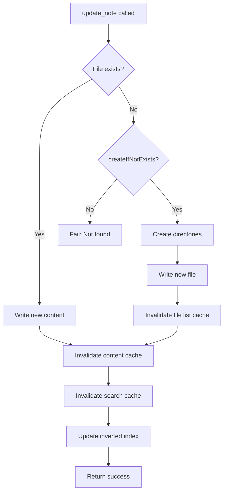

# update_note

Update an existing note in the Obsidian vault.

## Description

Replaces the content of an existing note. Optionally creates the note if it doesn't exist when `createIfNotExists` is set to `true`.

## Parameters

| Parameter           | Type      | Required | Default | Description                                       |
| ------------------- | --------- | -------- | ------- | ------------------------------------------------- |
| `path`              | `string`  | Yes      | -       | Path to the note within the vault                 |
| `content`           | `string`  | Yes      | -       | New content for the note                          |
| `createIfNotExists` | `boolean` | No       | `false` | Create note and directories if file doesn't exist |

## Returns

Success message confirming the update.

```json
{
  "content": [
    {
      "type": "text",
      "text": "Note updated successfully at notes/meeting.md"
    }
  ]
}
```

## Examples

### Update an existing note

```json
{
  "name": "update_note",
  "arguments": {
    "path": "notes/meeting.md",
    "content": "# Updated Meeting Notes\n\nNew content here."
  }
}
```

### Create or update (upsert)

```json
{
  "name": "update_note",
  "arguments": {
    "path": "new-folder/new-note.md",
    "content": "# New Note\n\nThis creates the note if it doesn't exist.",
    "createIfNotExists": true
  }
}
```

## Behavior



### With createIfNotExists: false (default)

- Updates existing files
- Fails if file doesn't exist
- Fails if directory doesn't exist

### With createIfNotExists: true

- Updates existing files
- Creates file if it doesn't exist
- Creates missing directories automatically

### Cache Invalidation

After updating a note:
1. Content cache entry for the file is invalidated
2. Search result cache is cleared
3. Inverted index entry is invalidated (for re-indexing on next read)

## Error Handling

| Error                             | Cause                                          |
| --------------------------------- | ---------------------------------------------- |
| `"Path and content are required"` | Missing required parameters                    |
| `"Note not found: {path}"`        | File doesn't exist and createIfNotExists=false |
| `EACCES`                          | Permission denied                              |

## Quick Reference

| Operation                             | File Exists | File Doesn't Exist | Missing Directories | Result  |
| ------------------------------------- | ----------- | ------------------ | ------------------- | ------- |
| update_note (default)                 | Updates     | Fails              | Fails               | Error   |
| update_note (createIfNotExists: true) | Updates     | Creates file       | Creates dirs        | Success |

## Related Tools

- [create_note](create_note.md) - Create-only operation
- [read_note](read_note.md) - Read the note content
- [delete_note](delete_note.md) - Delete the note

## Source

- Handler: [`src/handlers/toolHandlers.ts`](../../src/handlers/toolHandlers.ts)
- Service: [`src/services/fileSystem.ts`](../../src/services/fileSystem.ts)
